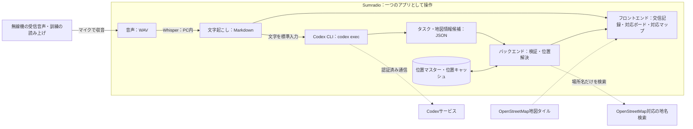

# Sumradio 技術仕様書

**「マイク入力（無線機の受信音声・訓練の読み上げ）→WAV音声→ローカルWhisper→Markdownの交信記録→Codex CLI→JSONのタスク・地図情報候補→位置解決→対応ボード・OpenStreetMap」を、一つのアプリとしてつなぐ計画です。**

本書は提示された構成図に基づく技術要件です。性能の数値は目標であり、実測結果は検証記録を参照してください。

### 実装時の追加仕様（2026-09-15）

- `demo_profile_id` は架空 `aoba`、実在 `tokyo`、通常 `local`。両デモでは外部地名検索を常に無効にする。
- `run_id` ごとに交信・タスク・履歴・処理対象版を保存し、デモ切り替え後の処理結果も元の実施回へ保存する。場所の人間確認キャッシュはプロファイル単位で分ける。
- 実施回に任意の`region: {prefecture, municipality}`を保存する。都道府県は47都道府県から選び、市区町村は1地域を入力する。既存記録では`null`扱い。開始後の地域変更APIは設けず、新しい実施回で指定し直す。
- 実在デモは上野恩賜公園・代々木公園・永代橋の3交信を追加する。地点の正式名・別名・自治体・代表点/詳細地点・座標・出典・確認日を登録する。曖昧な入口などを代表点で自動確定しない。
- Python 3.12、FastAPI、React/TypeScript、Leaflet、SSEを使用する。Whisper medium、CPU・INT8、Codex既定モデル `gpt-5.6-luna`。設定で抽出モデルを変更できる。
- 保存の確定点は実施回の原子的な `state.json` 更新。Markdown・交信JSON・タスクJSONは派生ファイルとして生成し、保存途中の停止は再起動時に再生成して復旧する。録音WAVは交信IDを付けて逐次保存する。
- 変更APIは `expected_version` と操作者を受け取り、古い版の編集を拒否する。SSEは実施回IDと状態の版を持ち、再接続時に最新状態を再取得する。
- 全10交信に加えR01〜R03を検証し、各デモの選択した90秒の組み合わせを3回ずつ実測する。模擬テスト、保存テキストでのCodex確認、マイクによる実機検証を区別する。

## 1. 全体構成

図の囲みは、利用者が一つのアプリとして操作する範囲です。音声処理・保存・画面はPC側で動かし、情報整理は同じPCにインストールしたCodex CLIをバックエンドから実行します。モデルとの通信と認証はCodex CLIに任せ、Sumradio自身はOpenAI APIキーを保持・送信しません。文字記録は画面へ直接渡すため、Codexの応答や位置解決を待たずに交信を読めます。LLMは地点表現を解釈しますが緯度・経度は生成せず、位置マスターまたは地名検索の結果をバックエンドが検証して地図へ反映します。

## 2. 各処理の役割

| 処理 | 入力 → 出力 | 役割 |
| --- | --- | --- |
| マイク入力・録音 | マイク音声 → WAV | 無線機の受信音声や訓練の読み上げをマイクで取り込み、発話と受信時刻を記録する |
| ローカルWhisper | WAV → Markdown | 発話を文字起こしし、原文と音声の参照先を残す |
| Codex CLI | 交信テキスト → JSON | `codex exec`で発信者・宛先・場所・状況・人数・要求と地図記号の候補を整理する |
| 位置解決 | 地点表現 → 位置候補 | ローカル位置マスター、保存済みキャッシュ、OpenStreetMap対応の地名検索の順に照合し、緯度・経度の候補を返す |
| アプリのバックエンド | Markdown・JSON・位置候補 → 表示用データ | データ形式と根拠、位置候補を確認し、保存・配信・人間の操作を管理する |
| フロントエンド | 交信記録・タスク・位置 → 画面 | 原文と整理結果、OpenStreetMapを並べ、訂正・承認・対応状態・場所の変更を受け付ける |

Pythonで録音・Whisper・Codex CLIの子プロセス実行をまとめ、FastAPIでローカルのブラウザ画面と接続する方針です。字幕とタスクの更新はSSEによる逐次配信を想定します。利用するCodexのモデルは、CLIで利用可能なものからJSON出力の安定性、処理時間、利用条件を確認して選定します。

## 3. WAVからMarkdownの文字記録を作る

音声入力はすべて選択したマイクから行います。WAVはマイクから取り込んだ音声の保存・内部処理に使用し、録音済みWAVファイルを入力する機能は設けません。5秒間の無音を発話の区切りとし、5秒に達する前に発話が再開した場合は同じ発話として継続します。冒頭を取りこぼさないよう直前の音声を保持し、自動区切りが難しい場合は画面から開始・終了を操作します。

元の音声を保存し、認識用には16 kHz・モノラルへ変換します。フィルタや弱いノイズ低減は同じ録音で比較し、認識が改善する場合に使います。文字起こしには `faster-whisper` を使用し、モデルは `medium` とします。使用PCで処理速度と認識品質を確認します。

発話ごとに交信IDを発行し、受信時刻・文字起こし原文・音声への参照をMarkdownに保存します。暫定字幕は発話中から画面だけに逐次表示し、無音5秒または手動終了による区切りの確定後、確定した文字記録をCodex CLIへ渡します。訂正時は元の認識結果を保持し、訂正文・修正者・時刻を別に残します。

確定認識のキューと暫定字幕の最新要求は独立した処理ループで扱います。CTranslate2の推論ワーカー2件で同じmediumの重みを共有し、実行中の暫定字幕の終了待ちを避けます。確定認識は同時1件に制限し、確定が待機・実行中には新たな暫定認識を始めません。古い交信の字幕が後から届いても表示しません。CPUの既定値は認識1件あたり4スレッドで、設定変更可能です。確定対象を直近20秒に短縮したり、字幕を確定原文へ流用したりはしません。キュー待ち・音声変換/保存・認識本体の時間を別々に記録します。

時間測定では、実際に話し終えた時点と、無音5秒で区切りを確定した時点を区別します。確定文字記録の表示目標は区切りの確定から測り、無音の待ち時間は含めません。暫定字幕の表示遅延と、実際に話し終えてから確定文字記録が表示されるまでの総時間も別々に記録します。手動終了による測定結果は自動区切りと分けます。

## 4. Codex CLIでタスクJSONを作る

### 音声認識の誤りへの耐性（2026-09-15追加）

文字起こし原文を改変せず、句点・改行・長さで原文箇所を分割して`source_id`を付けます。これは引用のための区切りであり、通話表の検知条件には使用しません。抽出LLMは根拠の箇所IDだけを返し、バックエンドがそのIDの存在を検証して原文引用・交信ID・対象版を付与します。原文を言い換えた引用による失敗を防ぎ、未登録の参照IDは拒否します。

誤認識の可能性を解釈する場合は`transcript_interpretations`に意味の仮説・理由・原文の根拠を保存し、人間の訂正文とは分離します。関連するタスクには聞き取り確認の注意を付けます。品目を特定できなくても要請意思が明確なら、その確認を含む`request`候補を残します。数量・地名・人名・否定等を推測で確定せず、不明な分類は`other`、不明値は空値とします。状態遷移・人間の承認・不正な構造化出力の拒否は従来どおりです。

バックエンドは非対話実行の `codex exec` を子プロセスとして起動します。利用者は事前にCodex CLIへログインし、CLIに保存された認証を使用します。Sumradio用のAPIキー設定は設けません。Codex CLIが未導入、未認証、通信不能の場合は情報整理を失敗として扱い、文字記録と手動登録機能は利用できる状態を保ちます。

Codexへ渡すのは、抽出指示と通話表の参照データ、発話後の文字起こし、必要な場合に限って関連する交信・既存タスクの情報です。WAV音声や保存フォルダ全体は渡しません。入力はシェル文字列へ展開せず、子プロセスの標準入力から渡します。各処理は履歴を引き継がない一時セッションとし、読み取り専用のサンドボックスで実行します。

Codexには、原文を根拠に次の項目を整理するよう指示します。`--output-schema`でJSON Schemaを指定し、最終応答だけを標準出力または一時ファイルから受け取ります。公式仕様では、`codex exec`はスクリプトからの非対話実行、保存済みCLI認証の再利用、JSON Schemaに従う構造化出力に対応しています（[OpenAI公式ドキュメント](https://learn.chatgpt.com/docs/non-interactive-mode)）。

| JSONで扱う情報 | 内容 |
| --- | --- |
| 交信情報 | 発信者、宛先、場所、報告された状況、要救護者の人数と内訳 |
| 地図情報候補 | 原文の地点表現、正規化した検索語、自治体・地区・施設種別などの補足、地図記号の分類、場所の確認要否 |
| 通話表の解釈 | 和文・欧文通話表による表現と、意図された文字・語句へ変換した値 |
| 候補種別・生成根拠 | `request`（明示的な要請）または `situation_confirmation`（状況確認）と、その判断根拠となる原文 |
| 要求・タスク候補 | 対応内容、対象、数量・単位、場所、発話に明示された担当や期限 |
| 根拠 | 元の交信ID、判断の根拠となる原文箇所、関連するタスクID |
| 確認事項 | 不明・矛盾のある項目、否定・保留、重複の可能性、既存タスクへの完了報告と根拠 |

発信者と宛先は発話中の呼び出し名から識別します。通話表の参照元は [japanese_phonetic.md](japanese_phonetic.md)（和文）と [nato_phonetic.md](nato_phonetic.md)（欧文・NATO）とします。バックエンドは起動時に各ファイルの `phonetic-table:start` と `phonetic-table:end` のマーカー間にある表を読み込み、「文字」「通話表の表記」「追加の検知表記」の3列を検証します。追加表記は半角セミコロンで分割し、対応表とともに各タスク抽出時の参照データとしてCodexへ渡します。表の変更は再起動後に反映し、別の辞書への手動転記は不要とします。

通話表は、LLMが文字起こしを解釈するための補助資料です。バックエンドは表との一致による機械的な置換を行わず、Codexが前後の文脈から通話表の使用と意図された文字・語句を判断します。解釈した個々の文字は表の「文字」欄に合わせ、「朝日のあ」は「ア」、「アルファ」は「A」とJSONに記録します。タスクの文章としての表記は文脈に応じて整え、原文・解釈した文字との対応を残します。

英字の大小や表に記載された読みの揺れを解釈の参考とし、「ホテルへ向かって」「アルファ波」などの通常語句は変換しません。和文の数字の読みは文字を一つずつ伝える表現として扱い、一般の人数・数量と混同しません。文字起こし原文は変更せず、解釈が曖昧な場合は「未確認」とします。

通話表の解釈には、専用モード、特定キーワード、表現の連続数、句読点の有無による固定の検知条件を設けません。参照表は抽出指示と区別した資料として渡し、音声認識モデルの補助文へ渡したり、ライブ字幕の原文を置き換えたりしません。

人数と物資数量を別項目にし、不明値は空値として返し、画面では「未確認」と表示します。人命・安全・避難所運営・物資など、本部の確認や対応判断が必要な状況報告は、明示的な要求がなくても `situation_confirmation` として返します。具体的な対応方法や優先順位は推測せず、対応判断を必要としない情報共有は0件を許容します。明示的な要請は `request` として区別し、「未完了」等の否定を優先します。

完了報告は、関連する既存タスクIDと根拠を持つ確認事項として返し、新規タスク候補とは分けます。新しい対応が必要でなければ新規候補は0件で構いません。対象が特定できない場合は交信側に「未確認」として残し、状態を変更しません。確認事項は既存の画面内で提示し、専用のボードや第三のタスク種別は追加しません。

バックエンドはCodex CLIの終了コード、タイムアウト、出力サイズを確認した後、JSONの必須項目・型・参照IDを検証します。不正な応答は整理失敗として表示し、自動で対応ボードへ登録しません。形式が正しい場合も確認前の整理結果として扱い、内容は人間が原文・音声と照合します。Codex CLIにはアプリの保存先を変更させず、タスクの承認や対応済みへの変更も許可しません。検証済みJSONの保存はバックエンドだけが行います。

地図情報候補の `map_categories` は5.2の15種類の列挙値から選ばせ、判断根拠の原文を必須とします。一つのタスクが複数分類に該当する場合は複数値を保持します。負傷者の報告は`injury`、救急隊・搬送の要請を伴う場合は`rescue`も付けます。けがのない救助から負傷を推測せず、負傷者・火災が否定されている場合や有無だけが未確認の場合は、それらの被害分類を追加しません。分類は地図上の記号を選ぶためだけに使い、危険度や対応優先順位へ変換しません。緯度・経度はCodexの出力項目に含めず、LLMが推測した座標を採用しません。

## 5. OpenStreetMap上の対応マップ

### 5.1 場所の解釈と座標の確定

地域指定時は、マスター・人間確認済みキャッシュの自治体名を地域条件で絞ります。複数自治体にまたがる地点は登録名のいずれかに一致すれば候補になります。「東区」を「台東区」と部分一致させないなど行政単位を保って照合し、境界ポリゴンから包含を計算する機能とは区別します。明示された交信の自治体と設定地域が矛盾する場合は未確認とし、設定で原文や抽出済み自治体を上書きしません。位置処理は元の実施回の地域を参照します。地域はWhisper/Codexへ追加せず、バックエンドの位置照合にだけ使います。

位置確認キャッシュはプロファイルごとのファイルを保ち、地域指定時はキーへ地域を加えて同名地点の上書きを防ぎます。通常利用の外部検索では地域を検索語へ付加し、`addressdetails=1`・日本語の住所を取得して、返された自治体も地域と一致する場合だけ候補にします。住所不足なら未確認。検索キャッシュキーにはプロファイル・接続先・地域を含む検索条件を含めます。両デモの外部検索禁止は維持します。方式は[Nominatim公式検索仕様](https://nominatim.org/release-docs/latest/api/Search/)を参照します。

`GET /api/regions`は都道府県の選択肢、`POST /api/runs`は任意の地域付き作成、実施回の取得・一覧は地域を返します。`GET /api/runs/{run_id}/locations`は対象地域の登録地点を返し、初期地図表示に使います。登録地点が0件なら地域の座標を推測せず、地図中心を外部検索しません。Markdownにも地域が発言ではなく開始時の設定であることを明記します。

Codexは原文から地点表現を抜き出し、表記を整えた検索語と地区・自治体・施設種別などの補足を返します。座標の確定はバックエンドの責任とし、次の順で解決します。

1. デモ地点や組織内の拠点を登録したローカル位置マスターを完全一致・別名で検索する。
2. 過去に人間が確定した位置キャッシュを検索する。
3. 設定されたOpenStreetMap対応のジオコーダーへ、地点の検索に必要な文字列だけを送る。
4. 一意に決まらない場合は候補を表示し、人間が選択する。候補がなければ「場所未確認」として手動指定を待つ。

同名の施設や橋を誤って表示しないよう、複数候補の自動確定は行いません。人間が確定・訂正した緯度、経度、表示名、検索元、操作時刻を保存します。架空の青葉地区を使うデモでは、台本の地点をデモ用位置マスターへ登録し、実在しない地点を外部検索で補いません。

聞き取りの地名承認は、保存済み`transcript_interpretations`から`interpretations.py`が読み取り専用の位置候補を導出します。最新の交信版・引用・元の抽出地点・対象タスクを照合し、同じ引用内に複数の異なる地点がある場合は対応を推測しません。正式名または登録別名の完全一致と地域・自治体・詳細地点の条件を満たすマスター1件のみを提示し、キャッシュや外部検索で解釈候補を補完しません。

`GET /api/runs/{run_id}`は保存用`Run`を拡張した`RunView`として、非保存の`interpretation_locations`を返します。この候補を通常の位置候補や地図へ自動投入しません。人間の`POST /api/runs/{run_id}/tasks/{task_id}/interpretation-location`で、`expected_version`・交信ID・版・解釈の番号・地点IDを受け取り、保存ロック内で候補を再導出して検証します。座標はクライアントから受け取らず登録値を使い、位置と採用解釈・根拠・操作履歴を同一スナップショットへ原子的に保存します。古い解釈・二重操作・別回の根拠・曖昧な候補は409、既存の原文・数量・タスク状態は不変です。遅れて届く位置検索結果も人間の確認を上書きしません。

### 5.2 地図と記号の表示

フロントエンドはLeafletなどの地図ライブラリを用い、OpenStreetMapの地図タイル上にタスクのピンを重ねます。地図には常に `© OpenStreetMap contributors` とライセンスへのリンクを見える状態で表示します。

| `map_categories` | 地図記号 | 表す内容 |
| --- | --- | --- |
| `road_blocked` | バツ印 | 橋・道路の崩落、土砂、倒木などの通行障害 |
| `water` | 水滴 | 飲料水、給水に関する要請 |
| `injury` | 🩸 血のしずく | 負傷者・けが。出血の有無や重症度は表さない |
| `rescue` | 🚑 救急車 | 救助、救急隊、搬送に関する要請・確認 |
| `medical` | 🩺 聴診器 | 体調不良、医療相談、医薬品。病名を診断しない |
| `fire` | 🔥 炎 | 火災、煙の報告・確認 |
| `flood` | 🌊 波 | 浸水、冠水、河川氾濫 |
| `building_damage` | 🏚️ 壊れた建物 | 建物の損傷、倒壊 |
| `communication` | 📡 アンテナ | 無線機・電話等の通信障害 |
| `missing_person` | 🔍 虫眼鏡 | 行方不明、人物の安否確認 |
| `sanitation` | 🚻 トイレ | トイレ、し尿処理、衛生環境 |
| `supplies` | 📦 箱 | 食料、毛布、衣服などの一般物資 |
| `evacuation` | 🏃 避難印 | 避難、移送に関する要請・確認 |
| `power` | ⚡ 稲妻 | 停電、電池、電源に関する要請・確認 |
| `other` | 感嘆符 | 上記に当てはまらない要確認事項 |

色だけに依存せず、記号、文字ラベル、凡例を併用します。候補ピンは「未確認」、未対応ピンは「未対応」と分かる外観にします。同じ座標に複数タスクがある場合はクラスタまたは一覧で個別カードを開けるようにし、後のタスクで前のタスクを上書きしません。ピンを選ぶとタスクID、種別、概要、状態、元の交信と根拠を表示し、カード側からも対応するピンへ移動できます。

同一点の表示対象タスクの分類を合わせ、重複を除いて凡例順で最大3記号を表示します。4分類以上は残りの分類数を`+N`、複数タスクは別の件数バッジで表示し、ポップアップではタスクごとの全分類を読めます。負傷者の記号を表示順の先頭に置きますが、この順序は危険度・優先順位ではありません。過去の保存済み分類や手動で選んだ分類は再分類せず、必要な変更は通常の編集・履歴へ残します。

地図は保存されたタスク状態から導出する表示とします。`candidate`（タスク候補）と `unhandled`（未対応）は表示し、人間の操作で `completed`（対応済み）または `discarded`（破棄）になったタスクは通常の地図から除外します。状態変更イベントを受けて即時更新しますが、ピンの操作だけでタスク状態を変更しません。履歴画面では、非表示になったタスクの確定位置と記号を後から確認できます。

### 5.3 OpenStreetMapサービスの利用条件

デモで `tile.openstreetmap.org` を利用する場合は、[OpenStreetMap FoundationのTile Usage Policy](https://operations.osmfoundation.org/policies/tiles/)に従い、正しいHTTPS URL、可視の出典表示、ブラウザのReferer、HTTPキャッシュを使用します。タイルURLは設定で交換可能にし、先読み・一括ダウンロード・オフライン用の取得は行いません。標準タイルサービスには可用性保証がないため、実運用やオフライン運用では、利用条件が用途に合うOSM由来の地図サービスまたは自己ホストしたタイルへ切り替えます。

公開Nominatimを明示的に採用する場合は、[Nominatim Usage Policy](https://operations.osmfoundation.org/policies/nominatim/)に従い、アプリを識別するUser-AgentまたはRefererを送り、1秒1リクエスト以下、単一スレッド、結果のキャッシュ、サービスURLの設定切り替えを実装します。自動補完、定期的・大量の検索、同一地点の反復検索は行いません。外部検索へ送るのは場所の特定に必要な文字列だけとし、人物、負傷内容、要請本文などを含めません。機密性の高い実運用では公開サービスへ運用地点を送らず、ローカル位置マスターまたは自己ホストしたジオコーダーを使用します。OpenStreetMapデータの表示と利用は[著作権とライセンス](https://www.openstreetmap.org/copyright)に従います。

## 6. 保存と画面更新

| 保存形式 | 保存する内容 |
| --- | --- |
| WAV | 元の録音と認識用に処理した音声 |
| Markdown（.md） | 交信ID・時刻・文字起こし原文・訂正記録・音声への参照 |
| JSON（.json） | 交信から整理した項目、タスク候補、人間が確定した対応状態、地図分類、地点表現、確定座標、位置の検索元・確認状態、根拠、変更履歴 |

WAV・Markdown・JSONを共通の交信IDで結び付けます。タスクには独立したIDを持たせ、複数の根拠交信を参照できるようにします。アプリが保存と読み込みを管理し、再起動後も交信と対応状態を復元する方針です。

画面は、文字記録の保存直後に交信を表示し、JSONの検証後に新規タスク候補を「タスク候補」ボードへ追加します。交信情報と既存タスクへの確認事項は、対応する交信・タスクに関連付けて表示します。未処理の交信には「整理待ち」、実行中は「Codexで整理中」、実行に失敗した交信には「Codex整理失敗」、位置を確定できないタスクには「場所未確認」を表示します。対応ボードは「タスク候補」「未対応」「対応済み」の3列を維持し、候補カードに「要請」または「状況確認」のラベルを表示します。対応マップは同じタスクデータを参照し、別の状態管理や第4のボードを設けません。

手動登録では、人間が種別・内容・根拠を入力し、新しいタスクIDを発行して「タスク候補」へ保存します。新規登録は状態遷移と区別し、AI抽出・手動登録のどちらも登録後は同じ承認フローを使います。

重複の可能性がある候補には関連タスクIDと根拠を示します。初期版は専用のタスク統合機能を設けず、人間が不要な候補を破棄し、必要に応じて既存タスクの内容や根拠交信を編集します。数量を自動で合算せず、既存タスクIDと対応状態を維持したまま編集内容を履歴に残します。破棄した候補は通常のボードから非表示にし、元の交信・候補・破棄履歴は保存します。

登録後の状態遷移は、人間の明示的な操作による「タスク候補→未対応」「タスク候補→破棄」「未対応→対応済み」だけを許可します。ボード移動前に確認を求め、バックエンドでも許可された遷移か検証します。完了報告が届いても自動では移動せず、人間が根拠を確認して既存の「未対応」タスクを「対応済み」へ移動します。変更前後の状態・操作時刻を履歴へ保存し、対応済み・破棄への遷移後は該当ピンを通常の地図から除外します。

通信断やCodex CLI、地図タイル、地名検索の待ち時間が、録音・Whisper・文字表示・ボード操作を止めないよう処理を分けます。失敗時は文字記録を残して手動登録と手動位置指定ができるようにし、再試行で同じ候補を重複登録しないよう交信IDと処理履歴を確認します。原文の訂正後に古いCodexや位置検索の結果が届いた場合も、訂正後の内容や人間の操作を上書きしないよう、処理対象の版を照合します。

## 7. 当日の検証

保存テキストによる画面単体の確認後、マイク入力→WAV保存・内部処理→Markdown→Codex CLI→JSON→画面の順に接続します。台本の読み上げと、無線機の受信音声をマイクで取り込む通し確認を行います。録音済みWAVの直接入力を実機検証の代わりにはしません。

| 確認内容 | 目標・確認方法 |
| --- | --- |
| 文字起こし | 台本と比較し、重要語の一致率80%以上を目標とする |
| 暫定字幕の速さ | 音声区間の取得から対応する暫定字幕の表示までの遅延と更新間隔を測定する。確定文字記録の目標とは分ける |
| 確定文字記録の速さ | 区切りの確定から表示まで、中央値3秒以内・95%の発話で5秒以内を目標に測定する。自動区切りでは無音待ち5秒を別計上し、実際の発話終了からの総時間も記録する |
| Codexによる整理 | 発信者・宛先・場所・状況・人数・要求を正解と比較し、JSON形式と根拠の一致を確認する |
| 地図情報の抽出 | 「青葉橋が崩落している」を `road_blocked`、「青葉避難所へ飲料水を手配」を `water` とし、地点表現、分類、根拠をJSONで返す。緯度・経度をLLMが生成しないことを確認する |
| 場所の確定 | 位置マスター、位置キャッシュ、地名検索の優先順、同名候補の人間確認、「場所未確認」と手動指定を確認する。架空の台本地点が外部検索で誤確定されないことも確認する |
| 地図とボードの連動 | タスク候補は未確認表示、未対応は未対応表示になり、カードとピンから相互に元の交信を開けることを確認する。対応済み・破棄へ人間が移した直後にピンが消え、履歴は残ることも確認する |
| 地図記号 | 台本01の青葉避難所を水滴印、04のあさぎ橋をバツ印で表示し、凡例・文字ラベル・複数タスクの個別表示・人間による訂正を確認する |
| OpenStreetMap利用 | 可視の出典表示、HTTPS、キャッシュ、設定可能なタイル・地名検索URLを確認する。公開Nominatimを使う場合は識別情報、1秒1リクエスト以下、キャッシュ、外部へ送る項目を通信ログで確認する |
| 状況確認の抽出 | 「青葉避難所に負傷者3名」から「状況確認」の候補を生成し、明示的な「要請」と区別できることを確認する |
| 通話表の解釈 | 両参照ファイルを補助資料として渡し、「符号は朝日のあです」「符号はアルファです」をそれぞれ「ア」「A」と解釈して原文と結果を保持する。「ホテルへ向かって」「アルファ波」を誤変換しないことも確認する |
| 通話表の読み込み | マーカーと3列の形式を検証し、追加表記の変更が再起動後の抽出入力へ反映され、音声認識の入力には混入しないことを確認する |
| タスク表示の速さ | Codex CLIの処理時間と、実際に話し終えてから候補表示までの総時間（無音待ちを含む）を別々に測る。文字表示の目標値と区別する |
| 操作・保存 | 3ボード構成と種別表示を保ち、手動登録も候補から始まること、承認・破棄・完了が人間の操作のみで確定すること、履歴と状態を再起動後も復元できることを確認する |
| 重複・完了報告 | 重複候補と既存タスクの関係を示し、人間による候補の破棄・既存タスクの編集で処理できることを確認する。数量を自動合算せず、完了報告だけで新規タスクや自動の完了処理が発生しないことも確認する |
| 障害時 | 通信断・不正JSON・地図タイル失敗・地名検索失敗・再試行でも文字記録とボード操作が残り、候補の重複や手動変更の上書きが起きないことを確認する |

[無線交信台本](無線交信台本.md)の全10交信を機能検証に使用します。90秒デモは台本の指定どおり01・02・03とし、読み合わせで時間が足りなければ01・02に絞ります。選定したデモの組み合わせを3回通し、交信番号、Codex CLIと利用モデルの版、認証状態、通信条件、処理時間、失敗・未確認事項を記録します。デモ用位置マスターで01・02・03の位置と記号を確認し、全件検証では04のあさぎ橋が通行障害のバツ印になることも確認します。完了報告のないデモでは、承認した要請タスクを「未対応」に保ちます。破棄・完了操作とピンの非表示は別の操作検証として実施し、台本による完了報告とは区別します。利用するライブラリ、Codex CLI、モデル、地図タイル、地名検索サービスの名称・版・利用条件も提出時に整理します。
