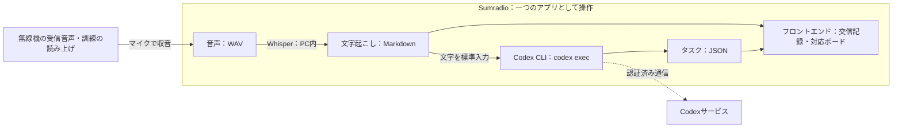

# Sumradio 技術仕様書

**「マイク入力（無線機の受信音声・訓練の読み上げ）→WAV音声→ローカルWhisper→Markdownの交信記録→Codex CLI→JSONのタスク→フロントエンド」を、一つのアプリとしてつなぐ計画です。**

本書は提示された構成図に基づく開発方針です。機能と数値は計画・目標であり、実装済み機能や測定結果ではありません。

## 1. 全体構成

図の囲みは、利用者が一つのアプリとして操作する範囲です。音声処理・保存・画面はPC側で動かし、情報整理は同じPCにインストールしたCodex CLIをバックエンドから実行します。モデルとの通信と認証はCodex CLIに任せ、Sumradio自身はOpenAI APIキーを保持・送信しません。文字記録は画面へ直接渡すため、Codexの応答を待たずに交信を読めます。

## 2. 各処理の役割

| 処理 | 入力 → 出力 | 役割 |
| --- | --- | --- |
| マイク入力・録音 | マイク音声 → WAV | 無線機の受信音声や訓練の読み上げをマイクで取り込み、発話と受信時刻を記録する |
| ローカルWhisper | WAV → Markdown | 発話を文字起こしし、原文と音声の参照先を残す |
| Codex CLI | 交信テキスト → JSON | `codex exec`で発信者・宛先・場所・状況・人数・要求を整理し、タスク候補を返す |
| アプリのバックエンド | Markdown・JSON → 表示用データ | データ形式と根拠を確認し、保存・配信・人間の操作を管理する |
| フロントエンド | 交信記録・タスク → 画面 | 原文と整理結果を並べ、訂正・承認・対応状態の変更を受け付ける |

Pythonで録音・Whisper・Codex CLIの子プロセス実行をまとめ、FastAPIでローカルのブラウザ画面と接続する方針です。字幕とタスクの更新はSSEによる逐次配信を想定します。利用するCodexのモデルは、CLIで利用可能なものからJSON出力の安定性、処理時間、利用条件を確認して選定します。

## 3. WAVからMarkdownの文字記録を作る

音声入力はすべて選択したマイクから行います。WAVはマイクから取り込んだ音声の保存・内部処理に使用し、録音済みWAVファイルを入力する機能は設けません。5秒間の無音を発話の区切りとし、5秒に達する前に発話が再開した場合は同じ発話として継続します。冒頭を取りこぼさないよう直前の音声を保持し、自動区切りが難しい場合は画面から開始・終了を操作します。

元の音声を保存し、認識用には16 kHz・モノラルへ変換します。フィルタや弱いノイズ低減は同じ録音で比較し、認識が改善する場合に使います。文字起こしには `faster-whisper` を使用し、モデルは `medium` とします。使用PCで処理速度と認識品質を確認します。

発話ごとに交信IDを発行し、受信時刻・文字起こし原文・音声への参照をMarkdownに保存します。暫定字幕は発話中から画面だけに逐次表示し、無音5秒または手動終了による区切りの確定後、確定した文字記録をCodex CLIへ渡します。訂正時は元の認識結果を保持し、訂正文・修正者・時刻を別に残します。

時間測定では、実際に話し終えた時点と、無音5秒で区切りを確定した時点を区別します。確定文字記録の表示目標は区切りの確定から測り、無音の待ち時間は含めません。暫定字幕の表示遅延と、実際に話し終えてから確定文字記録が表示されるまでの総時間も別々に記録します。手動終了による測定結果は自動区切りと分けます。

## 4. Codex CLIでタスクJSONを作る

バックエンドは非対話実行の `codex exec` を子プロセスとして起動します。利用者は事前にCodex CLIへログインし、CLIに保存された認証を使用します。Sumradio用のAPIキー設定は設けません。Codex CLIが未導入、未認証、通信不能の場合は情報整理を失敗として扱い、文字記録と手動登録機能は利用できる状態を保ちます。

Codexへ渡すのは、抽出指示と通話表の参照データ、発話後の文字起こし、必要な場合に限って関連する交信・既存タスクの情報です。WAV音声や保存フォルダ全体は渡しません。入力はシェル文字列へ展開せず、子プロセスの標準入力から渡します。各処理は履歴を引き継がない一時セッションとし、読み取り専用のサンドボックスで実行します。

Codexには、原文を根拠に次の項目を整理するよう指示します。`--output-schema`でJSON Schemaを指定し、最終応答だけを標準出力または一時ファイルから受け取ります。公式仕様では、`codex exec`はスクリプトからの非対話実行、保存済みCLI認証の再利用、JSON Schemaに従う構造化出力に対応しています（[OpenAI公式ドキュメント](https://learn.chatgpt.com/docs/non-interactive-mode)）。

| JSONで扱う情報 | 内容 |
| --- | --- |
| 交信情報 | 発信者、宛先、場所、報告された状況、要救護者の人数と内訳 |
| 通話表の解釈 | 和文・欧文通話表による表現と、意図された文字・語句へ変換した値 |
| 候補種別・生成根拠 | `request`（明示的な要請）または `situation_confirmation`（状況確認）と、その判断根拠となる原文 |
| 要求・タスク候補 | 対応内容、対象、数量・単位、場所、発話に明示された担当や期限 |
| 根拠 | 元の交信ID、判断の根拠となる原文箇所、関連するタスクID |
| 確認事項 | 不明・矛盾のある項目、否定・保留、重複の可能性、既存タスクへの完了報告と根拠 |

発信者と宛先は発話中の呼び出し名から識別します。通話表の参照元は [japanese_phonetic.md](japanese_phonetic.md)（和文）と [nato_phonetic.md](nato_phonetic.md)（欧文・NATO）とします。バックエンドは起動時に各ファイルの `phonetic-table:start` と `phonetic-table:end` のマーカー間にある表を読み込み、「文字」「通話表の表記」「追加の検知表記」の3列を検証します。追加表記は半角セミコロンで分割し、対応表とともに各タスク抽出時の参照データとしてCodexへ渡します。表の変更は再起動後に反映し、別の辞書への手動転記は不要とします。

通話表は、LLMが文字起こしを解釈するための補助資料です。バックエンドは表との一致による機械的な置換を行わず、Codexが前後の文脈から通話表の使用と意図された文字・語句を判断します。解釈した個々の文字は表の「文字」欄に合わせ、「朝日のあ」は「ア」、「アルファ」は「A」とJSONに記録します。タスクの文章としての表記は文脈に応じて整え、原文・解釈した文字との対応を残します。

英字の大小や表に記載された読みの揺れを解釈の参考とし、「ホテルへ向かって」「アルファ波」などの通常語句は変換しません。和文の数字の読みは文字を一つずつ伝える表現として扱い、一般の人数・数量と混同しません。文字起こし原文は変更せず、解釈が曖昧な場合は「未確認」とします。

通話表の解釈には、専用モード、特定キーワード、表現の連続数、句読点の有無による固定の検知条件を設けません。参照表は抽出指示と区別した資料として渡し、音声認識モデルの補助文へ渡したり、ライブ字幕の原文を置き換えたりしません。

人数と物資数量を別項目にし、不明値は空値として返し、画面では「未確認」と表示します。人命・安全・避難所運営・物資など、本部の確認や対応判断が必要な状況報告は、明示的な要求がなくても `situation_confirmation` として返します。具体的な対応方法や優先順位は推測せず、対応判断を必要としない情報共有は0件を許容します。明示的な要請は `request` として区別し、「未完了」等の否定を優先します。

完了報告は、関連する既存タスクIDと根拠を持つ確認事項として返し、新規タスク候補とは分けます。新しい対応が必要でなければ新規候補は0件で構いません。対象が特定できない場合は交信側に「未確認」として残し、状態を変更しません。確認事項は既存の画面内で提示し、専用のボードや第三のタスク種別は追加しません。

バックエンドはCodex CLIの終了コード、タイムアウト、出力サイズを確認した後、JSONの必須項目・型・参照IDを検証します。不正な応答は整理失敗として表示し、自動で対応ボードへ登録しません。形式が正しい場合も確認前の整理結果として扱い、内容は人間が原文・音声と照合します。Codex CLIにはアプリの保存先を変更させず、タスクの承認や対応済みへの変更も許可しません。検証済みJSONの保存はバックエンドだけが行います。

## 5. 保存と画面更新

| 保存形式 | 保存する内容 |
| --- | --- |
| WAV | 元の録音と認識用に処理した音声 |
| Markdown（.md） | 交信ID・時刻・文字起こし原文・訂正記録・音声への参照 |
| JSON（.json） | 交信から整理した項目、タスク候補、人間が確定した対応状態、根拠、変更履歴 |

WAV・Markdown・JSONを共通の交信IDで結び付けます。タスクには独立したIDを持たせ、複数の根拠交信を参照できるようにします。アプリが保存と読み込みを管理し、再起動後も交信と対応状態を復元する方針です。

画面は、文字記録の保存直後に交信を表示し、JSONの検証後に新規タスク候補を「タスク候補」ボードへ追加します。交信情報と既存タスクへの確認事項は、対応する交信・タスクに関連付けて表示します。未処理の交信には「整理待ち」、実行中は「Codexで整理中」、実行に失敗した交信には「Codex整理失敗」を表示します。対応ボードは「タスク候補」「未対応」「対応済み」の3列を維持し、候補カードに「要請」または「状況確認」のラベルを表示します。

手動登録では、人間が種別・内容・根拠を入力し、新しいタスクIDを発行して「タスク候補」へ保存します。新規登録は状態遷移と区別し、AI抽出・手動登録のどちらも登録後は同じ承認フローを使います。

重複の可能性がある候補には関連タスクIDと根拠を示します。初期版は専用のタスク統合機能を設けず、人間が不要な候補を破棄し、必要に応じて既存タスクの内容や根拠交信を編集します。数量を自動で合算せず、既存タスクIDと対応状態を維持したまま編集内容を履歴に残します。破棄した候補は通常のボードから非表示にし、元の交信・候補・破棄履歴は保存します。

登録後の状態遷移は、人間の明示的な操作による「タスク候補→未対応」「タスク候補→破棄」「未対応→対応済み」だけを許可します。ボード移動前に確認を求め、バックエンドでも許可された遷移か検証します。完了報告が届いても自動では移動せず、人間が根拠を確認して既存の「未対応」タスクを「対応済み」へ移動します。変更前後の状態・操作時刻を履歴へ保存します。

通信断やCodex CLIの待ち時間が、録音・Whisper・文字表示を止めないよう処理を分けます。失敗時は文字記録を残して手動登録できるようにし、再試行で同じ候補を重複登録しないよう交信IDと処理履歴を確認します。原文の訂正後に古いCodexの結果が届いた場合も、訂正後の内容や人間の操作を上書きしないよう、処理対象の版を照合します。

## 6. 当日の検証

保存テキストによる画面単体の確認後、マイク入力→WAV保存・内部処理→Markdown→Codex CLI→JSON→画面の順に接続します。台本の読み上げと、無線機の受信音声をマイクで取り込む通し確認を行います。録音済みWAVの直接入力を実機検証の代わりにはしません。

| 確認内容 | 目標・確認方法 |
| --- | --- |
| 文字起こし | 台本と比較し、重要語の一致率80%以上を目標とする |
| 暫定字幕の速さ | 音声区間の取得から対応する暫定字幕の表示までの遅延と更新間隔を測定する。確定文字記録の目標とは分ける |
| 確定文字記録の速さ | 区切りの確定から表示まで、中央値3秒以内・95%の発話で5秒以内を目標に測定する。自動区切りでは無音待ち5秒を別計上し、実際の発話終了からの総時間も記録する |
| Codexによる整理 | 発信者・宛先・場所・状況・人数・要求を正解と比較し、JSON形式と根拠の一致を確認する |
| 状況確認の抽出 | 「青葉避難所に負傷者3名」から「状況確認」の候補を生成し、明示的な「要請」と区別できることを確認する |
| 通話表の解釈 | 両参照ファイルを補助資料として渡し、「符号は朝日のあです」「符号はアルファです」をそれぞれ「ア」「A」と解釈して原文と結果を保持する。「ホテルへ向かって」「アルファ波」を誤変換しないことも確認する |
| 通話表の読み込み | マーカーと3列の形式を検証し、追加表記の変更が再起動後の抽出入力へ反映され、音声認識の入力には混入しないことを確認する |
| タスク表示の速さ | Codex CLIの処理時間と、実際に話し終えてから候補表示までの総時間（無音待ちを含む）を別々に測る。文字表示の目標値と区別する |
| 操作・保存 | 3ボード構成と種別表示を保ち、手動登録も候補から始まること、承認・破棄・完了が人間の操作のみで確定すること、履歴と状態を再起動後も復元できることを確認する |
| 重複・完了報告 | 重複候補と既存タスクの関係を示し、人間による候補の破棄・既存タスクの編集で処理できることを確認する。数量を自動合算せず、完了報告だけで新規タスクや自動の完了処理が発生しないことも確認する |
| 障害時 | 通信断・不正JSON・再試行でも文字記録が残り、候補の重複や手動変更の上書きが起きないことを確認する |

[無線交信台本](無線交信台本.md)の全10交信を機能検証に使用します。90秒デモは台本の指定どおり01・02・03とし、読み合わせで時間が足りなければ01・02に絞ります。選定したデモの組み合わせを3回通し、交信番号、Codex CLIと利用モデルの版、認証状態、通信条件、処理時間、失敗・未確認事項を記録します。完了報告のないデモでは、承認した要請タスクを「未対応」に保ちます。破棄・完了操作は別の操作検証として実施し、台本による完了報告とは区別します。利用するライブラリ、Codex CLI、モデルの名称・版・利用条件も提出時に整理します。
