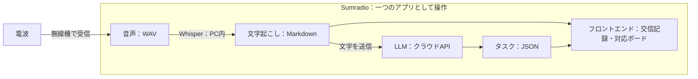

# Sumradio 技術仕様書

**「電波→WAV音声→ローカルWhisper→Markdownの交信記録→クラウドLLM→JSONのタスク→フロントエンド」を、一つのアプリとしてつなぐ計画です。**

本書は提示された構成図に基づく開発方針です。機能と数値は計画・目標であり、実装済み機能や測定結果ではありません。

## 1. 全体構成

図の囲みは、利用者が一つのアプリとして操作する範囲です。音声処理・保存・画面はPC側で動かし、LLMによる情報整理はクラウドAPIで行います。文字記録は画面へ直接渡すため、LLMの応答を待たずに交信を読めます。

## 2. 各処理の役割

| 処理 | 入力 → 出力 | 役割 |
| --- | --- | --- |
| 無線受信・録音 | 電波 → WAV | 無線機の受信音声をPCへ取り込み、発話と受信時刻を記録する |
| ローカルWhisper | WAV → Markdown | 発話を文字起こしし、原文と音声の参照先を残す |
| クラウドLLM | 交信テキスト → JSON | 発信者・宛先・場所・状況・人数・要求を整理し、タスク候補を返す |
| アプリのバックエンド | Markdown・JSON → 表示用データ | データ形式と根拠を確認し、保存・配信・人間の操作を管理する |
| フロントエンド | 交信記録・タスク → 画面 | 原文と整理結果を並べ、訂正・承認・対応状態の変更を受け付ける |

Pythonで録音・Whisper・クラウドAPI呼び出しをまとめ、FastAPIでローカルのブラウザ画面と接続する方針です。字幕とタスクの更新はSSEによる逐次配信を想定します。クラウドLLMの提供元・モデルは、JSON出力の安定性、処理時間、利用条件を確認して選定します。

## 3. WAVからMarkdownの文字記録を作る

入力デバイスを選び、約1秒の無音を発話の区切りとします。冒頭を取りこぼさないよう直前の音声を保持し、自動区切りが難しい場合は画面から開始・終了を操作します。録音済みWAVも同じ認識経路へ入力できるようにします。

元の音声を保存し、認識用には16 kHz・モノラルへ変換します。フィルタや弱いノイズ低減は同じ録音で比較し、認識が改善する場合に使います。Whisperの実行には `faster-whisper` を採用予定です。暫定字幕に `small`、発話後の認識に `kotoba-whisper-v2.0` の変換モデルを候補とし、使用PCで速度と品質を確認します。

発話ごとに交信IDを発行し、受信時刻・文字起こし原文・音声への参照をMarkdownに保存します。暫定字幕は画面だけに更新し、発話後の文字記録をLLMへ渡します。訂正時は元の認識結果を保持し、訂正文・修正者・時刻を別に残します。

## 4. クラウドLLMでタスクJSONを作る

LLMへ渡すのは、発話後の文字起こしと、必要な場合に限って関連する交信・既存タスクの情報です。WAV音声や保存フォルダ全体は送信しません。APIの認証情報はバックエンドで管理します。

LLMには、原文を根拠に次の項目を整理するよう指示し、定めたJSON形式で応答させます。

| JSONで扱う情報 | 内容 |
| --- | --- |
| 交信情報 | 発信者、宛先、場所、報告された状況、要救護者の人数と内訳 |
| 要求・タスク候補 | 対応内容、対象、数量・単位、場所、発話に明示された担当や期限 |
| 根拠 | 元の交信ID、判断の根拠となる原文箇所、関連するタスクID |
| 確認事項 | 不明・矛盾のある項目、否定・保留、重複候補、完了報告の候補 |

発信者と宛先は発話中の呼び出し名から識別します。人数と物資数量を別項目にし、不明値は空値として返し、画面では「未確認」と表示します。状況報告だけならタスク候補は0件を許容します。「未完了」等の否定を優先し、完了報告は関連候補として返す設計です。

バックエンドでJSONの必須項目・型・参照IDを検証します。不正な応答は整理失敗として表示し、自動で対応ボードへ登録しません。形式が正しい場合も候補として扱い、内容は人間が原文・音声と照合します。LLMがタスクの承認や対応済みへの変更を直接実行することはありません。

## 5. 保存と画面更新

| 保存形式 | 保存する内容 |
| --- | --- |
| WAV | 元の録音と認識用に処理した音声 |
| Markdown（.md） | 交信ID・時刻・文字起こし原文・訂正記録・音声への参照 |
| JSON（.json） | 交信から整理した項目、タスク候補、人間が確定した対応状態、根拠、変更履歴 |

WAV・Markdown・JSONを共通の交信IDで結び付けます。タスクには独立したIDを持たせ、複数の根拠交信を参照できるようにします。アプリが保存と読み込みを管理し、再起動後も交信と対応状態を復元する方針です。

画面は、文字記録の保存直後に交信を表示し、JSONの検証後に整理情報とタスク候補を追加します。文字記録には「AI整理中」「整理失敗」等を表示します。対応ボードは「候補→未対応→対応済み」とし、状態変更と根拠追加は人間の操作で保存します。

通信断やLLMの待ち時間が、録音・Whisper・文字表示を止めないよう処理を分けます。失敗時は文字記録を残して手動登録できるようにし、再試行で同じ候補を重複登録しないよう交信IDと処理履歴を確認します。原文の訂正後に古いLLM結果が届いた場合も、訂正後の内容や人間の操作を上書きしないよう、処理対象の版を照合します。

## 6. 当日の検証

保存テキストで画面を確認した後、WAV→Markdown→LLM→JSON→画面の順に接続し、最後にライブ無線で通し確認します。

| 確認内容 | 目標・確認方法 |
| --- | --- |
| 文字起こし | 台本と比較し、重要語の一致率80%以上を目標とする |
| 文字表示の速さ | 発話終了から文字表示まで、中央値3秒以内・95%の発話で5秒以内を目標に測定する |
| LLMによる整理 | 発信者・宛先・場所・状況・人数・要求を正解と比較し、JSON形式と根拠の一致を確認する |
| タスク表示の速さ | LLMの処理時間と、発話終了から候補表示までを別々に測る。文字表示の目標値と区別する |
| 操作・保存 | 原文保持、人間による承認、別地点の要求の分離、未完了の扱い、再起動後の復元を確認する |
| 障害時 | 通信断・不正JSON・再試行でも文字記録が残り、候補の重複や手動変更の上書きが起きないことを確認する |

デモ5交信を3回通し、利用したモデル、通信条件、処理時間、失敗・未確認事項を記録します。利用するライブラリとクラウドサービス、モデルの名称・版・利用条件も提出時に整理します。
