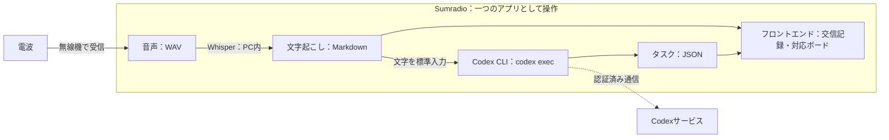

# Sumradio 技術仕様書

**「電波→WAV音声→ローカルWhisper→Markdownの交信記録→Codex CLI→JSONのタスク→フロントエンド」を、一つのアプリとしてつなぐ計画です。**

本書は提示された構成図に基づく開発方針です。機能と数値は計画・目標であり、実装済み機能や測定結果ではありません。

## 1. 全体構成

図の囲みは、利用者が一つのアプリとして操作する範囲です。音声処理・保存・画面はPC側で動かし、情報整理は同じPCにインストールしたCodex CLIをバックエンドから実行します。モデルとの通信と認証はCodex CLIに任せ、Sumradio自身はOpenAI APIキーを保持・送信しません。文字記録は画面へ直接渡すため、Codexの応答を待たずに交信を読めます。

## 2. 各処理の役割

| 処理 | 入力 → 出力 | 役割 |
| --- | --- | --- |
| 無線受信・録音 | 電波 → WAV | 無線機の受信音声をPCへ取り込み、発話と受信時刻を記録する |
| ローカルWhisper | WAV → Markdown | 発話を文字起こしし、原文と音声の参照先を残す |
| Codex CLI | 交信テキスト → JSON | `codex exec`で発信者・宛先・場所・状況・人数・要求を整理し、タスク候補を返す |
| アプリのバックエンド | Markdown・JSON → 表示用データ | データ形式と根拠を確認し、保存・配信・人間の操作を管理する |
| フロントエンド | 交信記録・タスク → 画面 | 原文と整理結果を並べ、訂正・承認・対応状態の変更を受け付ける |

Pythonで録音・Whisper・Codex CLIの子プロセス実行をまとめ、FastAPIでローカルのブラウザ画面と接続する方針です。字幕とタスクの更新はSSEによる逐次配信を想定します。利用するCodexのモデルは、CLIで利用可能なものからJSON出力の安定性、処理時間、利用条件を確認して選定します。

## 3. WAVからMarkdownの文字記録を作る

入力デバイスを選び、5秒間の無音を発話の区切りとします。無音が5秒に達する前に発話が再開した場合は、同じ発話として継続します。冒頭を取りこぼさないよう直前の音声を保持し、自動区切りが難しい場合は画面から開始・終了を操作します。録音済みWAVも同じ認識経路へ入力できるようにします。

元の音声を保存し、認識用には16 kHz・モノラルへ変換します。フィルタや弱いノイズ低減は同じ録音で比較し、認識が改善する場合に使います。文字起こしには `faster-whisper` を使用し、モデルは `medium` とします。使用PCで処理速度と認識品質を確認します。

発話ごとに交信IDを発行し、受信時刻・文字起こし原文・音声への参照をMarkdownに保存します。暫定字幕は画面だけに更新し、発話後の文字記録をCodex CLIへ渡します。訂正時は元の認識結果を保持し、訂正文・修正者・時刻を別に残します。

## 4. Codex CLIでタスクJSONを作る

バックエンドは非対話実行の `codex exec` を子プロセスとして起動します。利用者は事前にCodex CLIへログインし、CLIに保存された認証を使用します。Sumradio用のAPIキー設定は設けません。Codex CLIが未導入、未認証、通信不能の場合は情報整理を失敗として扱い、文字記録と手動登録機能は利用できる状態を保ちます。

Codexへ渡すのは、発話後の文字起こしと、必要な場合に限って関連する交信・既存タスクの情報です。WAV音声や保存フォルダ全体は渡しません。入力はシェル文字列へ展開せず、子プロセスの標準入力から渡します。各処理は履歴を引き継がない一時セッションとし、読み取り専用のサンドボックスで実行します。

Codexには、原文を根拠に次の項目を整理するよう指示します。`--output-schema`でJSON Schemaを指定し、最終応答だけを標準出力または一時ファイルから受け取ります。公式仕様では、`codex exec`はスクリプトからの非対話実行、保存済みCLI認証の再利用、JSON Schemaに従う構造化出力に対応しています（[OpenAI公式ドキュメント](https://learn.chatgpt.com/docs/non-interactive-mode)）。

| JSONで扱う情報 | 内容 |
| --- | --- |
| 交信情報 | 発信者、宛先、場所、報告された状況、要救護者の人数と内訳 |
| 通話表の解釈 | 和文・欧文通話表による表現と、意図された文字・語句へ変換した値 |
| 候補種別・生成根拠 | `request`（明示的な要請）または `situation_confirmation`（状況確認）と、その判断根拠となる原文 |
| 要求・タスク候補 | 対応内容、対象、数量・単位、場所、発話に明示された担当や期限 |
| 根拠 | 元の交信ID、判断の根拠となる原文箇所、関連するタスクID |
| 確認事項 | 不明・矛盾のある項目、否定・保留、重複候補、完了報告の候補 |

発信者と宛先は発話中の呼び出し名から識別します。Codexへの指示には和文・欧文通話表の解釈規則と例を含め、「朝日のあ」を「あ」、「アルファ」を「A」のように変換してタスクへ反映します。文字起こし原文は変更せず、変換前の表現を根拠としてJSONに残します。解釈が曖昧な場合は推測で確定せず、「未確認」として返します。

人数と物資数量を別項目にし、不明値は空値として返し、画面では「未確認」と表示します。人命・安全・避難所運営・物資など、本部の確認や対応判断が必要な状況報告は、明示的な要求がなくても `situation_confirmation` として返します。具体的な対応方法や優先順位は推測せず、対応判断を必要としない情報共有は0件を許容します。明示的な要請は `request` として区別し、「未完了」等の否定を優先します。完了報告は関連候補として返す設計です。

バックエンドはCodex CLIの終了コード、タイムアウト、出力サイズを確認した後、JSONの必須項目・型・参照IDを検証します。不正な応答は整理失敗として表示し、自動で対応ボードへ登録しません。形式が正しい場合も候補として扱い、内容は人間が原文・音声と照合します。Codex CLIにはアプリの保存先を変更させず、タスクの承認や対応済みへの変更も許可しません。検証済みJSONの保存はバックエンドだけが行います。

## 5. 保存と画面更新

| 保存形式 | 保存する内容 |
| --- | --- |
| WAV | 元の録音と認識用に処理した音声 |
| Markdown（.md） | 交信ID・時刻・文字起こし原文・訂正記録・音声への参照 |
| JSON（.json） | 交信から整理した項目、タスク候補、人間が確定した対応状態、根拠、変更履歴 |

WAV・Markdown・JSONを共通の交信IDで結び付けます。タスクには独立したIDを持たせ、複数の根拠交信を参照できるようにします。アプリが保存と読み込みを管理し、再起動後も交信と対応状態を復元する方針です。

画面は、文字記録の保存直後に交信を表示し、JSONの検証後に整理情報を「タスク候補」ボードへ追加します。文字記録には「Codexで整理中」「Codex整理失敗」等を表示します。対応ボードは「タスク候補」「未対応」「対応済み」の3列を維持し、候補カードに「要請」または「状況確認」のラベルを表示します。

状態遷移は、人間の明示的な操作による「タスク候補→未対応」「タスク候補→破棄」「未対応→対応済み」だけを許可します。ボード移動前に確認を求め、バックエンドでも許可された遷移か検証します。Codexやバックエンド処理による自動移動は行わず、変更前後の状態・操作時刻を履歴へ保存します。

通信断やCodex CLIの待ち時間が、録音・Whisper・文字表示を止めないよう処理を分けます。失敗時は文字記録を残して手動登録できるようにし、再試行で同じ候補を重複登録しないよう交信IDと処理履歴を確認します。原文の訂正後に古いCodexの結果が届いた場合も、訂正後の内容や人間の操作を上書きしないよう、処理対象の版を照合します。

## 6. 当日の検証

保存テキストで画面を確認した後、WAV→Markdown→Codex CLI→JSON→画面の順に接続し、最後にライブ無線で通し確認します。

| 確認内容 | 目標・確認方法 |
| --- | --- |
| 文字起こし | 台本と比較し、重要語の一致率80%以上を目標とする |
| 文字表示の速さ | 発話終了から文字表示まで、中央値3秒以内・95%の発話で5秒以内を目標に測定する |
| Codexによる整理 | 発信者・宛先・場所・状況・人数・要求を正解と比較し、JSON形式と根拠の一致を確認する |
| 状況確認の抽出 | 「青葉避難所に負傷者3名」から「状況確認」の候補を生成し、明示的な「要請」と区別できることを確認する |
| 通話表の解釈 | 和文・欧文通話表を含む交信から意図された文字・語句をタスクへ反映し、原文を保持できることを確認する |
| タスク表示の速さ | Codex CLIの処理時間と、発話終了から候補表示までを別々に測る。文字表示の目標値と区別する |
| 操作・保存 | 3ボード構成を保ち、候補の種別表示、承認・破棄、未対応から対応済みへの移動が人間の操作でのみ行われ、履歴と状態を再起動後も復元できることを確認する |
| 障害時 | 通信断・不正JSON・再試行でも文字記録が残り、候補の重複や手動変更の上書きが起きないことを確認する |

デモ5交信を3回通し、Codex CLIと利用モデルの版、認証状態、通信条件、処理時間、失敗・未確認事項を記録します。利用するライブラリ、Codex CLI、モデルの名称・版・利用条件も提出時に整理します。
