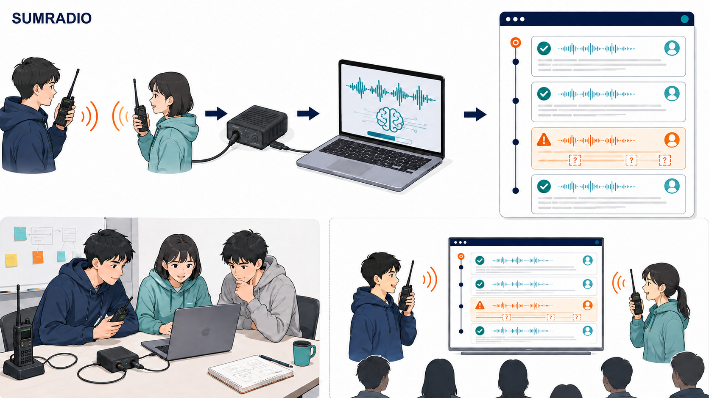

# Sumradio ハッカソン実行計画

## 0. この計画の結論

Sumradioは、無線交信を発話単位で文字起こしし、時刻付きの記録としてブラウザへ表示する「第二の記録係」を1日で実装する。

当日の最優先は、次の一本の経路を正午までに完成させることである。

> チームの無線送信 → PCへの音声入力 → 発話単位の文字起こし → 時刻付きタイムライン表示

逐語字幕、重複検出、全文検索、高度な語彙補正は、上記が安定した後だけ着手する。文字起こしは参考情報であり、監査証跡や自動判断には使用しない。



> この画像はImageGenで作成した議論用モックであり、最終UI仕様ではない。

## 1. 課題と提供価値

災害対策本部では、現場から届く無線音声を担当者が手書きで記録することが多い。聞き逃しや書き漏らしが起きると、情報だけでなく「情報が欠落した事実」も残らない。

Sumradioは、無線音声を時系列の参考記録へ変換し、次の価値を提供する。

- 交信内容を後から確認できる
- 地名、人数、時刻などの重要情報を探しやすくする
- AIの不確実性を隠さず、人間の確認へつなげる
- 手書き記録を置き換えるのではなく、記録担当者を補助する

### 想定ユーザー

- 災害対策本部で無線交信を記録する自治体職員・防災担当者
- 特定小電力無線などを利用する消防団・自主防災組織

デジタル簡易無線などへの展開は将来構想とし、今回のデモ対象には含めない。

## 2. 1日MVPのスコープ

### 必須機能

- 技適表示のある特定小電力トランシーバーからPCへ音声を入力できる
- PTTを離してから発話単位で文字起こしできる
- 各発話を受信時刻付きでタイムラインへ追加できる
- すべてのAI文字起こしを初期状態「要確認」として表示できる
- 人間が「確認済み」へ変更できる
- 地名・人数・時刻・否定語を、色だけに依存せずラベルや装飾で強調できる
- 入力、処理中、API切断、失敗の状態を画面上で確認できる

### ストレッチゴール

- 音声認識結果の途中表示
- デモ用辞書による地名・部隊符号のハイライト
- 該当音声の再生による再確認
- ローカルASRへの自動切り替え
- 過去ログの検索とJSONLエクスポート

### 今回は実装しない

- 第三者の無線通信の収集・保存
- 消防・警察・自衛隊などの実通信を使ったデモ
- LLMによる推測補完や自動訂正
- 重複報告の自動統合
- 複数無線系統の同時処理
- 監査証跡としての真正性保証
- AI結果だけに基づく自動的な災害対応判断
- 画像・動画を無線周波数帯へ載せる機能

## 3. MVPの技術構成

### 主系

1. 特定小電力トランシーバーからPCへ音声信号を入力する（Audacityで波形確認済み）
2. Pythonで入力デバイスを固定し、生音声を保存したうえで16 kHz・モノラルPCMへ変換する
3. エネルギー閾値と終了無音0.8〜1.2秒で一発話を区切る
4. 帯域通過フィルタと弱いノイズ抑制を候補として適用する
5. ローカルWhisperで発話単位に文字起こしする
6. 無線用語辞書で通話表・地名・部隊符号を照合し、原文を残したまま注釈する
7. FastAPIが固定形式のイベントを生成し、SSEでブラウザへ配信する
8. 単一ページのタイムラインUIへ追記する

今回の「リアルタイム」は逐語ストリーミングではなく、PTT解放後に一発話ずつ数秒以内で表示する方式と定義する。Whisperモデルは `small`、`medium`、`large-v3` を実機で比較し、p95で5秒以内に表示できる最大モデルを採用する。詳細な音声前処理、推論設定、用語辞書、評価方法は [technical-requirements.md](./technical-requirements.md) に定義する。

### 最小イベント形式

```json
{
  "id": "01J...",
  "received_at": "2026-09-07T09:15:30+09:00",
  "raw_text": "訓練、青葉避難所、要支援者十五名",
  "normalized_text": "訓練、青葉避難所、要支援者15名",
  "status": "needs_review",
  "source": "live_radio",
  "model": "medium",
  "preprocess_profile": "bandpass",
  "highlights": [
    { "type": "place", "text": "青葉避難所" },
    { "type": "number", "text": "15名" }
  ],
  "latency_ms": 2400,
  "audio_ref": "local:event-id.wav"
}
```

- `status`: `recording | processing | needs_review | confirmed | failed`
- `source`: `live_radio | recorded_radio | mock`
- ASRの原文は保持し、訂正で黙って上書きしない
- 生音声、処理後音声、原文、正規化文を同じIDで追跡する
- 訂正する場合は、訂正文・修正者・修正時刻を別フィールドで残す
- 語単位のconfidenceが取れなくても成立する設計にする

### 不確実性の表示

- 全件を「AI文字起こし・要確認」で開始する
- 地名、人数、時刻、否定語はconfidenceに関係なく重点確認対象にする
- confidenceを利用できる場合のみ、低信頼区間を追加強調する
- 色に加えて「要確認」ラベルと警告アイコンを表示する
- 画面上部に「デモ／訓練」「対応判断に単独使用しない」を常時表示する

## 4. 開催前に完了する準備

### 意思決定と開発環境

- [ ] デモPCで `faster-whisper` を実行できるPython環境を固定する
- [ ] Whisperモデルを事前にダウンロードし、オフライン状態で推論できることを確認する
- [ ] `small`、`medium`、`large-v3` の精度・遅延・メモリ使用量を実測する
- [ ] ライブラリとモデルのライセンス、配布条件を確認する
- [ ] 実際の無線録音で前処理・用語補助の比較試験を完了する
- [ ] チーム3名のGitHubアクセスと担当ブランチを確認する
- [ ] ホスティングは利用せず、デモPCのlocalhostで動作させる

### 機材

- [ ] 技適表示のある同一規格の特定小電力トランシーバー2台以上
- [x] 無線機からPCへ音声信号を入力できる構成
- [x] Audacityでの波形確認
- [ ] 本番と同じ構成で10分間連続録音できることを確認
- [ ] デモPC、予備PC、電源アダプター、電源タップ
- [ ] 予備ケーブル、予備電池または充電器、イヤホン
- [ ] テザリング可能な回線
- [ ] 予備チャンネルと混信時の中止・変更手順

無線機のイヤホン出力とPC入力は、端子のピン配列、信号レベル、モノラル／ステレオ、接地ノイズを含め、実機で前日までに確認する。直結で過入力になる場合は減衰器を使用する。

### テスト環境とデータ

- [ ] 正常、ノイズ入り、音切れ入りの無線録音を各5発話用意する
- [ ] 正解文字列付きの短い評価台本を用意する
- [ ] APIを使わずUIを開発できる固定JSONイベントを用意する
- [ ] 保存済み認識結果をタイムライン再生できるモードを用意する
- [ ] 正常動作時の画面録画を用意する
- [ ] ネットを切った状態で主系とフォールバックをリハーサルする
- [ ] 開発者以外が起動手順だけでデモを開始できることを確認する

### 音声・法令・プライバシー

- [ ] 発話者全員から録音・ローカル処理・デモ利用の同意を得る
- [ ] 台本の各交信を「訓練」で始める
- [ ] 実在人物、実在住所、電話番号、実在部隊名を台本に含めない
- [ ] 会場の無線利用ルールと使用可能チャンネルを確認する
- [ ] 第三者の交信を受信した場合は処理・保存を停止する
- [ ] デモ音声とログをイベント終了後に削除する担当と期限を決める

## 5. 未確定事項と決定期限

| 未確定事項 | 推奨案 | 決定期限 | 決定方法 |
| --- | --- | --- | --- |
| 無線機の機種・端子 | 手元の技適機種2台を使用 | 3日前 | 実機10分録音 |
| 音声入力経路 | PC入力・波形確認済み | 完了 | 10分連続録音で最終確認 |
| 発話区切り | 自動VAD＋手動停止 | 2日前 | 台本15発話で区切り成功率を確認 |
| ASR | ローカル `faster-whisper` | 3日前 | 3モデルの精度と遅延を比較 |
| 前処理 | `raw` と3種類のフィルタを比較 | 2日前 | CER・重要語正解率で決定 |
| 用語補助 | プロンプト／hotwords＋辞書注釈 | 2日前 | 通話表入り音声で比較 |
| confidence | 必須にしない | 2日前 | log probabilityを補助指標にする |
| デモPC・ブラウザ | 1台に固定 | 2日前 | 権限とデバイスIDを固定 |
| 保存期間 | イベント終了まで | 前日 | 全員の同意を記録 |

期限までに決まらない項目は、推奨案を採用する。実機接続またはASR疎通が前日までに成功しない場合は、ライブ方式を主デモにしない。

## 6. 3名の担当と責任境界

### A：無線・音声責任者

- 無線機、ケーブル、USBオーディオIF、電池を管理する
- 音声入力、録音、発話区切り、WAV生成を担当する
- 主系が失敗した場合の手動録音と事前録音への切り替えを判断する

### B：統合・バックエンド責任者

- Whisper推論、イベント整形、SSE配信、JSONL保存を担当する
- 推論モックとフォールバック再生モードを用意する
- 当日の機能削減、コード凍結、デモ経路の最終判断を行う

### C：フロントエンド・ピッチ責任者

- タイムライン、状態表示、要確認／確認済み導線を担当する
- デモ台本、ピッチ、画面録画を管理する
- Bが不在でも手順書からデモを起動できる状態にする

開始前にA→Bの音声ファイル仕様と、B→Cのイベント形式を固定する。各担当は短命ブランチで作業し、Bが統合する。

## 7. 当日のタイムボックスとゲート

| 時刻 | 作業 | 続行条件 | 未達時の判断 |
| --- | --- | --- | --- |
| 09:00–09:20 | 成功条件、イベント形式、担当、台本を確認 | 全員が同じデモ経路を説明できる | 必須機能を削る |
| 09:20–10:00 | A: Python実機録音、B: WAV→Whisper、C: モック→UI | 3系統が単体動作 | 各系統を代替案へ切替 |
| 10:00–11:30 | 録音WAV→ASR→SSE→UIを結合 | 時刻付き結果が画面に出る | 保存済み結果の再生を基準版にする |
| 11:30–12:30 | ライブ無線入力へ差し替える | 5発話を連続処理 | 事前録音を正式デモ経路にする |
| 12:30 | MVP基準版をタグ付け・凍結 | 再現可能な縦切りがある | 新機能追加を中止 |
| 13:00–14:00 | 確認導線・重要語表示を追加 | 基準版を壊さない | 変更を戻す |
| 14:00–15:00 | 台本10回で精度・遅延を測定 | 合格基準を満たす | 台本と閾値を調整 |
| 15:00 | 機能追加を停止 | バグ修正のみ | デモ録画へ集中 |
| 15:00–16:00 | 手順書、既知の制約、録画を完成 | 2分以内に起動・切替可能 | UI調整を中止 |
| 16:00–17:00 | ピッチと実機デモを3回通す | 3回連続成功 | 安定した下位レベルを採用 |

定時同期は10:00、11:30、12:30、15:00の4回に限定し、それ以外は各担当の作業を優先する。

## 8. デモのフォールバック

| レベル | 入力 | 認識 | 表示 | 使用条件 |
| --- | --- | --- | --- | --- |
| 0 | 実機無線 | ローカルWhisper | ライブUI | 通常 |
| 1 | 実機無線を発話ごとに録音 | ローカルWhisper | UI | 自動区切り失敗時 |
| 2 | 事前収録した無線音声 | ローカルWhisper | UI | 音声入力失敗時 |
| 3 | 事前収録音声 | 保存済み認識結果 | 時系列再生 | 推論遅延・モデル障害時 |
| 4 | 画面録画 | 保存済み映像 | 動画 | アプリ復旧不能時 |

- Whisper推論が10秒を超えたら軽量モデルへ切り替え、復旧しなければレベル3へ移行する
- PCが無線入力を認識しなければレベル2へ移行する
- 60秒以内に復旧しなければレベル4へ移行する
- ピッチ中の再試行は1回までとする
- フォールバック使用時はライブだと偽らず、利用している入力経路を説明する

## 9. 評価と合格基準

### 当日のGo／No-Go指標

- 既定台本5発話を順番どおり、クラッシュせず処理できる
- 5発話すべてがPTT解放後5秒以内に画面へ追加される
- 表示遅延の中央値が3秒以内である
- 地名・人数・時刻・否定語の80%以上を正しく表示できる
- すべてのAI結果に「要確認」が表示される
- 主系失敗から2分以内に下位のデモレベルへ移行できる
- 同じ構成で3回連続して通しデモが成功する

### 記録する評価値

- CER（文字誤り率）と参考値としてのWER
- 地名、人数、時刻、否定語のスロット正解率
- 「要確認」判定の適合率・再現率
- 表示遅延のp50・p95
- 発話区切り成功率
- 通しデモ成功率

すべてを未確認にすれば高得点になる単純な指標は使わない。音切れ、類似地名、数字の取り違え、否定、発話重なりを含むテストを行う。

## 10. リスクと対策

| リスク | 兆候 | 予防 | 当日の対策 |
| --- | --- | --- | --- |
| 音声配線不良 | 無音・音割れ | 実機と同じ構成で10分録音 | USBマイクでスピーカー音を拾う |
| 発話区切り失敗 | 分割・結合ミス | VAD閾値を事前調整 | 手動開始・停止へ切替 |
| Whisper推論遅延 | 表示が5秒を超える | 3モデルを事前比較 | 軽量モデルへ切替 |
| ASRの重要語誤認識 | 地名・数字・否定の誤り | 台本で事前測定 | 要確認表示と原音再生 |
| フィルタによる音声劣化 | 子音・通話表の誤認識増加 | `raw` との比較評価 | フィルタを無効化 |
| 電波混雑・第三者受信 | 混信 | 予備チャンネルと短距離運用 | 即時停止・非保存・チャンネル変更 |
| UIへの過信 | 誤認識を確定扱い | デモ／要確認表示を常設 | 人間確認の場面を実演 |
| 統合遅延 | 正午に縦切り未完成 | 入出力形式を事前固定 | 保存済み結果を基準版にする |

## 11. 90秒デモ台本

1. 画面に「デモ／訓練」「AI文字起こし・要確認」が見えていることを示す
2. 発話者Aが「訓練、本部、本部、こちら調査一班」と送信する
3. 発話者Aが「訓練、青葉避難所、要支援者15名、負傷者2名」と送信する
4. 時刻、本文、地名、人数がタイムラインへ表示される
5. ノイズ入り発話を送信し、要確認表示を見せる
6. 操作者が原音を確認し、「確認済み」へ変更する
7. 「完全自動化ではなく、不確実性を露出する第二の記録係」であると説明する

台本中の地名・部隊名・人数はすべて架空とし、交信ごとに「訓練」を付ける。

## 12. ピッチ構成

- 課題（20秒）: 手書きでは、聞き逃した事実そのものが残らない
- 実演（90秒）: 無線 → 文字起こし → 要確認 → 人間による確認
- 仕組み（30秒）: 無線入力、発話単位ASR、時系列UI
- 安全性（20秒）: 全件要確認、推測補完なし、訓練音声のみ
- 結果（20秒）: 遅延、重要情報正解率、通し成功率
- 将来性（20秒）: 災害対策本部から工事現場などへ展開

手書き、単純録音、一般字幕との差は「無線入力」「時系列記録」「重要情報の確認導線」「不確実性の明示」で示す。未実装機能を実装済みのように説明しない。

## 13. 独立レビュー結果

| 観点 | 主な指摘 | 計画への反映 |
| --- | --- | --- |
| 技術実現性 | 音声接続、発話区切り、confidenceが未確定 | 発話単位ASR、手動区切り、confidence非依存設計 |
| ハッカソン完走 | 正午までの統合と凍結条件がない | 時刻別ゲート、12:30基準版、15:00機能停止 |
| 安全・災害時UX | 高信頼の誤認識、色依存、AIへの過信 | 全件要確認、重点確認語、常設警告、人間確認フロー |
| 法令・プライバシー | 偶発受信、同意、保存期間が曖昧 | 訓練音声、即時停止、同意、終了後削除 |
| ピッチ | 成功例だけでは差別化が弱い | 誤認識から安全に復帰する場面を実演 |

## 14. 完成物

- 動作するプロトタイプ
- 1コマンドで始められる起動手順
- `.env.example` と秘密情報を除外した設定
- 正解文付き評価音声と評価結果
- 60〜90秒のデモ台本
- 正常動作時の画面録画
- 既知の制約とフォールバック手順
- ピッチ用の構成図とUIモック

## 15. 参考資料

- Google Drive: `codex開発祭_応募用.md`
- 技術要件: [technical-requirements.md](./technical-requirements.md)
- OpenAI Docs: [Whisperモデル](https://developers.openai.com/api/docs/models/whisper-1)
- OpenAI Docs: [音声文字起こしAPI](https://developers.openai.com/api/reference/resources/audio/subresources/transcriptions/methods/create)
