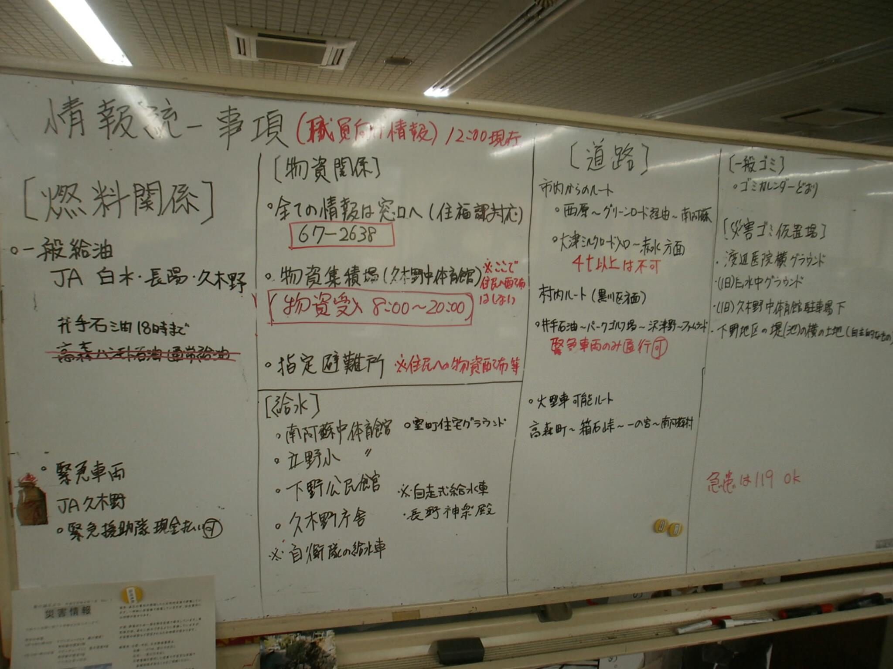

# Sumradio 発表構成案

## 1. 公式ルールから読み取れる採点方針

参照元: [OpenAI 大学生向け 夏の Codex 開発祭 2026 公式ルール](./OpenAI%20大学生向け%20夏の%20Codex%20開発祭%202026%20公式ルール.pdf)

### 第1段階

| 採点項目 | 配点 |
| --- | ---: |
| Codexの効果的な活用 | 20% |
| 実世界へのインパクト | 20% |
| 再利用・展開可能性 | 20% |
| デモおよびピッチの質 | 20% |
| 参加者投票（審査員による考慮） | 20% |

審査員が選定した上位4チームが第2段階へ進む。

### 第2段階

| 採点項目 | 配点 |
| --- | ---: |
| Codexの効果的な活用 | 25% |
| 実世界へのインパクト | 25% |
| 再利用・展開可能性 | 25% |
| デモおよびピッチの質 | 25% |

同点の場合は、最初に「Codexの効果的な活用」、次に「実世界へのインパクト」の得点で順位が決まる。

### 発表で優先すること

- Sumradioは「社会課題」のテーマとして提示する。
- Codexが単に開発を手伝っただけでなく、製品の中核で何を判断しているかを実演する。
- 実際に動く一連の体験を見せ、機能一覧の説明だけで終わらせない。
- 誰の、どの問題を、導入前後でどう変えるかを具体的に示す。
- 災害対応以外でも使える構造と、現場へ持ち込める条件を示す。
- 第1段階では参加者にも一度で伝わる短い言葉とデモを重視する。

### 発表準備と提出時の注意

- 提出物は、2026年9月15日9:00-21:00 JSTの公式開発期間中に実質的に開発する必要がある。
- 重要な既存コード、オープンソース、データセット、第三者ツールとライセンスは書面で開示する。
- 公式ルールで対象外とされる「医療AI」ではなく、無線情報の記録・整理と人間の意思決定支援として説明する。
- 事前作業は要件定義、技術仕様、台本などのドキュメント整備として示し、製品の実質的な開発は当日の公式開発期間に行ったことを区別する。

## 2. 推奨する発表の軸

### 中心メッセージ

**無線を、聞き流される情報から、人が確認できる対応事項へ。**

### 30秒で伝える説明

Sumradioは、災害対策本部に届く無線をリアルタイムで文字に残し、Codexが状況と要請をタスク候補へ整理するアプリです。AIが勝手に対応を確定せず、人間が原音と文字記録を確認して、対応するか、破棄するか、完了にするかを決めます。

### 独自性として強調する3点

1. 無線の文字起こしで終わらず、対応状況まで一画面でつなぐ。
2. 和文・欧文通話表を機械置換せず、Codexが文脈を踏まえて解釈する。
3. AIの抽出結果を「タスク候補」に留め、すべての状態変更を人間が承認する。

## 3. 推奨スライド構成

発表時間は公式ルール本文に具体的な分数がないため、以下は5分を想定した構成とする。当日の指定時間に応じて、デモ以外の説明時間を調整する。

| # | 時間 | スライドタイトル | 伝える内容 | 主に狙う採点項目 |
| ---: | ---: | --- | --- | --- |
| 1 | 15秒 | 無線を、対応に変える。 | 製品名、中心メッセージ、チーム名だけを表示する。 | ピッチ、参加者投票 |
| 2 | 35秒 | 災害対策本部の情報整理 | 実際の災害対策本部でホワイトボードに避難所情報を集約した写真を示す。交信が続くほど聞き漏らし、転記漏れ、対応状況の見失いが起きやすいことを説明する。 | 実世界へのインパクト |
| 3 | 30秒 | 交信から対応までの流れ | マイク入力、ライブ字幕、交信記録、タスク候補、未対応、対応済みの流れを一枚で示す。 | インパクト、再利用・展開可能性 |
| 4 | 50秒 | 開発前から製品内までのCodex活用 | 事前のドキュメント整備、当日のPlanモードとGoalモードによる開発、製品内のタスク抽出を一つの流れで示す。 | Codexの効果的な活用 |
| 5 | 100秒 | ライブデモ | 実際にマイクへ訓練交信を入力し、字幕、確定記録、Codexによる候補生成、人間の承認、未対応への移動までを見せる。 | 4項目すべて、参加者投票 |
| 6 | 35秒 | AstraによるGUIデバッグ | AstraがGUIを操作し、起動、問題の再現、ログ確認、修正後の再検証を連続して実行した記録を見せる。反復操作の大部分を自動化できたことを具体例で示す。 | Codexの効果的な活用、ピッチ |
| 7 | 25秒 | 人間の承認とオフライン化 | AIは候補生成に限定し、状態変更は人間が行う。現在のデモはCodexで抽出する一方、通信が途絶する災害現場に向け、同じJSONインターフェースをローカルLLMへ置き換える計画を示す。 | インパクト、再利用・展開可能性 |
| 8 | 10秒 | 聞こえた、で終わらせない。 | 中心メッセージを繰り返し、デモで起きた変化を一文で締める。 | ピッチ、参加者投票 |

合計: 5分

## 4. 90秒デモの見せ方

### 画面上で必ず見せる変化

1. 技適マークのある特定小電力トランシーバーで訓練交信を送受信する。
2. 受信機の音声をPCのマイクで取り込み、音声入力を開始する。
3. 発話中のライブ字幕が更新される。
4. 5秒の無音または手動終了で交信が確定する。
5. 文字記録がCodexの完了を待たずに先に表示される。
6. Codexが「要請」または「状況確認」のタスク候補を生成する。
7. 候補カードから元の交信を確認する。
8. 人間が承認し、「タスク候補」から「未対応」へ移動する。

デモ機材は「無線局免許を要しない特定小電力トランシーバー」と説明する。国内向けの技適マーク付き機材であることを事前に確認し、メーカー名と型番を予備スライドへ記載する。録音済み音声ではなく、実際の無線受信音をマイクで認識していることを見せる。

### 推奨シナリオ

- 原則は無線交信台本01・02・03を使用する。
- 3回の事前確認で90秒に収まらない場合は、01・02に絞る。
- 読み上げと操作を同時に行わず、発話担当と画面操作担当を分ける。
- 待ち時間には新しい説明を始めず、画面の状態表示を指して処理段階を短く説明する。
- デモ終了時に、異なる現場の要請が別カードとして「未対応」に並んだ状態を残す。

### デモ中の説明例

> 今、音声はPC内で文字起こしされ、交信記録が先に表示されました。次にCodexが、発信者、場所、人数、要請を原文と結び付けて整理します。ただし、ここではまだ候補です。本部担当者が原文を確認し、対応すると決めたものだけを未対応へ移します。

## 5. 採点項目と提示する証拠

| 採点項目 | 発表での主張 | その場で見せる証拠 |
| --- | --- | --- |
| Codexの効果的な活用 | 曖昧な無線交信を、根拠付きの構造化タスクへ変換する | Codex実行中の状態、生成JSONから作られたカード、原文へのリンク、開発当日のCodex利用記録 |
| 実世界へのインパクト | 本部の聞き漏らしと対応漏れを減らし、状況認識を助ける | 複数交信が記録とカードに分かれて残る一連のデモ |
| 再利用・展開可能性 | マイクと1台のPCを起点に導入でき、参照資料や抽出項目を現場に合わせられる | 構成図、設定・参照ファイル、再起動後の保存状態 |
| デモおよびピッチの質 | 入力から人間の承認までを、止めずに理解できる | 90秒の通しデモ、状態表示、最後の未対応ボード |
| 参加者投票 | 技術を知らなくても問題と価値を一度で理解できる | 冒頭と最後の同じメッセージ、災害現場に限定した具体例 |

主張は実測・実演できる範囲に限定する。認識率や処理時間は、当日に測定した値だけを表示する。

## 6. Codex活用スライドで示す内容

Codexの活用は、事前準備、当日の開発、製品内の3段階に分けて示す。

### 事前準備

- 要件定義、技術仕様、無線交信台本、通話表、AGENTS.mdをCodexと整備した。
- 仕様間の矛盾、音声処理とタスク抽出の責任範囲、人間の承認範囲を開発前に明文化した。
- 事前作業は設計と準備であり、提出物の実質的な開発とは区別して説明する。

### 当日の開発

- Planモードで、実装順、依存関係、検証方法を先に整理した。
- Goalモードで、完成条件を保ちながら長い実装と検証を継続した。
- AstraにGUI操作を任せ、アプリ起動、入力操作、不具合の再現、ログ確認、修正後の再検証を連続して行った。
- 「GUIデバッグをほぼ自動化した」という主張には、操作記録、修正差分、テスト結果を添える。
- 音声区切り、デモ台本の混入、タスク抽出失敗など、実際に解決した問題を一つだけ具体的に示す。

### 製品内での活用

- 現在のデモでは`codex exec`を非対話で実行し、文字起こしをJSONへ構造化する。
- 和文・欧文通話表を補助資料として渡し、前後関係を踏まえて解釈する。
- 明示的な「要請」と、本部の確認が必要な「状況確認」を分ける。
- AIには候補生成だけを許可し、状態の確定は人間に残す。
- 実運用では通信断を前提とし、タスク抽出部をローカルLLMへ置き換えて、文字起こしから候補生成までを端末内で完結させる。
- 抽出モデルの入出力を共通JSON仕様に保ち、Codex版とローカルLLM版をUIや人間の承認フローから分離する。

単に「Codexで作りました」と言うのではなく、Codexがなければ難しかった判断と、Codexへ任せなかった判断を対で説明する。

OpenAI公式資料は、GPT-6 Astraをコンピューター操作と複数工程の作業に強いモデルとして説明している。発表では一般的な性能紹介だけに頼らず、SumradioのGUIを実際に操作してデバッグした記録を主な証拠にする。

## 7. 使用する実写と出典

### 推奨写真

- 内容: 平成28年熊本地震の災害対策本部で、燃料、物資、給水、道路などの情報を分類したホワイトボード
- 保存先: [kumamoto-disaster-whiteboard.jpg](assets/kumamoto-disaster-whiteboard.jpg)
- 掲載ページ: [熊本災害デジタルアーカイブ「災害対策本部に設置されたホワイトボード」](https://www.kumamoto-archive.jp/post/58-99991jl0004uc4)
- 作成日: 2016年4月23日
- 作成場所: 熊本県阿蘇郡南阿蘇村
- 提供者: 兵庫県姫路市
- 推奨キャプション: 「平成28年熊本地震の災害対策本部。燃料、物資、給水、道路などの情報をホワイトボードに集約」
- 必須の出典表記: 「出典: 熊本災害デジタルアーカイブ／提供者: 兵庫県姫路市」

個別ページは「二次利用ができます」と明記している。サイトの利用条件に従い、提供者とアーカイブ名を表示し、改ざんに相当する加工は行わない。スライドでは原画像の縦横比を維持して使用する。

### スライド2の構図

- 写真を画面の約3分の2に大きく置く。
- 残りの領域に「場所、人数、時刻、対応状況が一枚へ集まる」と記載する。
- ホワイトボードを否定せず、即時に共有できる強みを認めたうえで、交信とのひも付け、検索、履歴、タスク管理をSumradioが補うと説明する。

## 8. 再利用・展開可能性の伝え方

### 再利用できる単位

- マイク音声から交信記録を作る処理
- 原文とAI整理結果を結ぶデータ構造
- タスク候補を人間が承認する3ボードの運用
- 通話表や抽出指示など、現場ごとに差し替えられる参照資料

### 通信環境への対応

| 段階 | タスク抽出 | 位置付け |
| --- | --- | --- |
| 今回のデモ | Codex CLI | Codexの文脈解釈能力を使い、抽出仕様と有用性を短期間で検証する |
| 将来の実運用 | ローカルLLM | 通信環境が失われた災害現場でも、端末内で候補生成を継続する |

発表では「現在すでに完全オフライン」とは説明しない。文字起こしはローカル処理だが、今回のCodexによるタスク抽出には通信が必要であることを明示する。そのうえで、共通JSONインターフェースにより抽出モデルを交換できる設計と、ローカルLLM化を次の開発段階として示す。

### 展開先の例

- 自治体・避難所の災害対応
- 大規模イベントの運営無線
- 施設警備や学内防災
- 通信環境が限定される現場の記録支援

「どこでも使える」と広げすぎず、共通する条件を「短い音声連絡が連続し、人が対応状況を管理する現場」と定義する。

## 9. 発表資料で避けること

- 技術スタックの一覧をデモより長く説明する。
- AIが医療診断、救護優先順位、対応完了を自動決定すると受け取られる表現を使う。
- Codex、Whisper、フロントエンドの役割を混同する。
- インターネット接続が必要なCodex処理まで「完全オフライン」と説明する。
- 未測定の認識率、削減時間、導入効果を実績として表示する。
- デモで全機能を見せようとして、主要な利用体験を分かりにくくする。
- 既存コード、ライブラリ、データセット、第三者ツールの開示を忘れる。
- 「免許不要」だけを強調し、技適マークや国内向け機材であることを確認しない。
- Astraの能力を形容詞だけで説明し、実際のGUI操作記録を見せない。

## 10. 最終4チーム向けの差し替え

第2段階では参加者投票が採点から外れ、4項目が各25%になる。基本の物語とデモは変えず、次の証拠を追加する。

- Codexが返す構造化データと検証処理を一段詳しく示す。
- 文字起こし精度、候補表示時間、失敗時の復旧を実測値で示す。
- 別の交信例または別の現場設定で、参照資料を差し替えられることを示す。
- 現場導入までの残課題を、機材、通信、運用、データ管理に分けて率直に示す。

## 11. 用意する予備スライド

1. システム構成図
2. Codexへの入力とJSON出力の例
3. 安全設計と人間の承認範囲
4. テスト結果と既知の制約
5. 既存コード・ライブラリ・データセット・第三者ツールの開示一覧
6. デモ失敗時に見せる、事前収録した同一シナリオの画面
7. 使用した特定小電力トランシーバーのメーカー、型番、技適マーク
8. Planモード、Goalモード、AstraによるGUIデバッグの操作記録
9. 現在の通信依存範囲と、ローカルLLMへ置き換えるオフライン化ロードマップ

## 12. 出典

- [OpenAI 大学生向け 夏の Codex 開発祭 2026 公式ルール](https://codex-student-hack-fes.openai.chatgpt.site/official-rules/)
- [電波法 第4条](https://laws.e-gov.go.jp/law/325AC0000000131/)および[電波法施行規則 第6条](https://laws.e-gov.go.jp/law/325M50080000014/)
- [GPT-6 Astra Model guidance](https://developers.openai.com/api/docs/guides/latest-model?model=gpt-6-astra)
- [内閣府 地区防災計画モデル地区の資料](https://www.bousai.go.jp/kyoiku/chikubousai/chikubo/chikubo/pdf/yokosuka_03.pdf)
- [熊本災害デジタルアーカイブ「災害対策本部に設置されたホワイトボード」](https://www.kumamoto-archive.jp/post/58-99991jl0004uc4)
- [熊本災害デジタルアーカイブ 利用条件](https://www.kumamoto-archive.jp/about-us)
