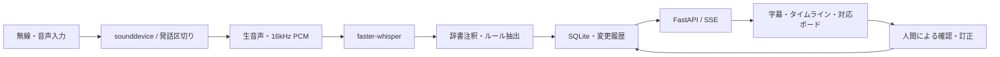

# Sumradio

無線交信のローカル文字起こしと、人間が確認する対応ボード。計画は [Plan/plan.md](Plan/plan.md)、詳細仕様は [Plan/technical-requirements.md](Plan/technical-requirements.md) を参照してください。

## 初期設定

Python 3.11〜3.13 と [uv](https://docs.astral.sh/uv/) を利用します。Sumradioディレクトリで実行してください。

```sh
uv run --extra audio sumradio setup
```

このコマンドで、uvが音声認識ライブラリ `faster-whisper` を含む依存パッケージをインストールし、続けて `setup` が以下のモデルを自動ダウンロードします。

- 暫定字幕用: `small`
- 確定字幕用: `kotoba-tech/kotoba-whisper-v2.0-faster`（kotoba-whisperのCTranslate2変換版）

モデルは既定で `models/` に保存します。モデルや保存先を変える場合は、実行前に `.env.example` を `.env` へコピーし、`SUMRADIO_PARTIAL_MODEL`・`SUMRADIO_FINAL_MODEL`・`SUMRADIO_MODEL_DIR` を編集してください。

**Macでuvを使わずに導入する場合は [macOS向け venv・pip手順](docs/macos-pip.md) を参照してください。** Pythonの準備から、画面の動作確認・音声認識・次回の起動まで説明しています。

HF_TOKEN未設定・Windowsのシンボリックリンク非対応の警告は、それぞれ短い `Note:` にまとめて一度だけ表示します。

何も表示されない場合は、`setup` の開始前にuvが依存パッケージを準備している可能性があります。終了していなければ `Ctrl+C` で中断し、Sumradioディレクトリで次を実行すると詳細ログを確認できます。

```sh
uv run --verbose --extra audio python -u -m sumradio setup
```

## 起動

```sh
uv run --extra audio sumradio
```

ブラウザで **http://127.0.0.1:8000** を開き、「保存済み台本を再生」を押します。初期設定後は `uv run --offline --extra audio sumradio` で起動できます。ポート変更は `uv run --extra audio sumradio serve --port 8001`。サーバーは127.0.0.1にのみバインドし、ホスティング・外部APIは使用しません。

台本再生は**推論なし・音声なし**です。AI精度や処理速度の検証には使えません。保存済みテキストを暫定字幕→確定字幕→タスク候補へ流し、利用経路を確認できます。

1. 確認者の名前を入力。
2. 交信の「内容を確認済みにする」で人間確認を記録。「訂正」は原文を保持し、訂正文・修正者・時刻を追加。
3. タスク候補を編集し「承認して未対応へ」。抽出漏れは交信の「タスク作成」で補完。
4. 完了報告が表示されてもタスクは自動で対応済みになりません。根拠を確認し、手動操作で確定。
5. 根拠リンクから交信へ戻り、WAV入力では原音・処理後音声も再生可能。

## 実際の音声を認識

```sh
uv run --extra audio sumradio devices
uv run --extra audio sumradio
```

先に「初期設定」を実行してください。追加モデルは `uv run --extra audio sumradio download-models <モデル名...>` で取得できます。推論は既定で `local_files_only=True` です。モデル未取得時は失敗を画面に表示します。

`uv` を使わない場合は初期設定した仮想環境で `sumradio` を実行します。初回準備後は外部接続を必要としません。

- Windows 11: 音声入力へのアクセスをOSのプライバシー設定で許可してください。
- Ubuntu 22.04: PortAudioがない場合は `sudo apt install libportaudio2` を実行してください。
- macOS（Apple Silicon / Intel）: CPU int8を使用します。音声入力の権限やPortAudioの確認は [macOS向け手順](docs/macos-pip.md#困ったとき) を参照してください。
- CUDA: `.env` の `SUMRADIO_DEVICE=cuda` でfloat16へ変更します。CUDA/cuDNN要件は [faster-whisper公式README](https://github.com/SYSTRAN/faster-whisper#gpu) を確認してください。CPUではint8を使用します。

画面の「無線入力・録音WAVを使う」を開き、入力デバイスを取得して選択します。自動モードはエネルギー閾値と1秒の無音で発話を区切ります。手動モードでは「手動録音開始」→「発話終了・認識」を操作します。物理PTT信号や専用スケルチ信号との直接連動は未実装で、手動操作または音声の無音検出で代替します。

生音声は入力のネイティブレート・最大2チャンネル・float32で保存。ASR用音声は16 kHz・モノラル・16-bit PCMで保存します。ライブ入力は最大30秒で分割。WAV取込は8〜192 kHz、1〜2ch、30秒・16 MiB以下です。録音済みWAVは確定認識のみで、暫定字幕はライブ入力と台本再生で表示します。

## 設定

`.env.example` を `.env` へコピーして編集します。再起動すると反映されます。

| 設定 | 既定値 | 意味 |
| --- | --- | --- |
| `SUMRADIO_PROFILE` | `raw` | 音声の前処理方式。比較後に `bandpass` / `wide-bandpass` / `bandpass-denoise` を選択 |
| `SUMRADIO_FINAL_MODEL` | `kotoba-tech/kotoba-whisper-v2.0-faster` | 確定字幕用の認識モデル |
| `SUMRADIO_PARTIAL_MODEL` | `small` | 暫定字幕用の認識モデル |
| `SUMRADIO_ENERGY_THRESHOLD` | `0.012` | 発話検出の音量閾値。入力音量に合わせて調整 |
| `SUMRADIO_SILENCE_SECONDS` | `1.0` | 発話終了と判定する無音時間（秒）。0.8〜1.2秒 |
| `SUMRADIO_MIN_SPEECH_SECONDS` | `0.2` | 発話開始と判定する最小音声時間（秒）。短いスケルチ音での開始を抑制 |
| `SUMRADIO_PREROLL_SECONDS` | `0.3` | 開始検出前に保持する音声の長さ（秒） |
| `SUMRADIO_MAX_SECONDS` | `30` | 連続録音の最大長（秒） |
| `SUMRADIO_PARTIAL_INTERVAL` | `0.75` | 暫定字幕の認識間隔（秒）。推論が終了した場合のみ次を投入 |
| `SUMRADIO_PARTIAL_WINDOW` | `6` | 暫定字幕で再認識する直近の音声の長さ（秒） |
| `SUMRADIO_NOTCH_HZ` | `0` | ハム除去の周波数（Hz）。実測したハムに応じて50/60を指定（0は無効、rawでは無効） |
| `SUMRADIO_DENOISE_STRENGTH` | `0.15` | ノイズ低減の強度。弱いスペクトル減衰 |
| `SUMRADIO_RADIO_MODE` | `true` | 明示的な符号読み・連続する通話表を注釈 |
| `SUMRADIO_USE_PROMPT` | `true` | 辞書を初期プロンプトへ反映 |
| `SUMRADIO_AUTO_EXTRACT` | `true` | 自動タスク・完了候補抽出の有効化。`false` で停止 |

通話表は次のMarkdownが編集元です。アプリが起動時に表を直接読み込み、文字起こし後の検知に使用します。

- [和文通話表](sumradio/config/japanese_phonetic.md): ア〜ン（ヰ・ヱを含む48文字）、濁点・半濁点などの記号、数字の読み。
- [NATOフォネティックコード表](sumradio/config/nato_phonetic.md): A〜Zのコードワードとカタカナ表記。

「追加の検知表記」欄に `;` 区切りで表記揺れを追加できます。例えば「朝日のあ」も「ア」の候補になります。編集後はサーバーを再起動してください。原文・文脈条件・前後の区切りを確認する処理は維持し、Markdownにない表現は推測しません。音声認識用の初期プロンプトには各表の先頭2件を例として含めますが、全文は渡しません。

地名・部隊名・無線用語は [sumradio/config/radio_terms.yaml](sumradio/config/radio_terms.yaml)、タスク抽出語は [sumradio/config/task_rules.json](sumradio/config/task_rules.json) で管理します。架空地名はデモ用です。

独自の `SUMRADIO_CONFIG_DIR` を使う場合も、同ディレクトリに2つのMarkdownが必要です。旧YAMLの `nato_phonetic` / `japanese_phonetic` は読み込み元として使用しません。独自の追加表記をMarkdownへ移してください。表の欠落・不正な形式・異なる文字への同一表記の重複は起動時にエラーとして通知します。

`raw` はリサンプルのみの比較基準です（ピーク超過時のみ-3 dBFSへ減衰）。その他はDC除去・SOS Butterworth帯域通過を適用します。数字・地名・否定語は自動訂正しません。技術要件の「原文を破壊しない正規化」に合わせ、通話表は `A（アルファ）` のように注釈します。

## データとAPI

台本・音声・文字起こしの保存先は次のとおりです。`data/` は既定の保存先で、`SUMRADIO_DATA_DIR` を設定した場合はそのディレクトリに変わります。

| 内容 | 保存先・確認する項目 |
| --- | --- |
| 「保存済み台本を再生」のデモ原稿 | [sumradio/fixtures/demo.json](sumradio/fixtures/demo.json) の各 `text`。5発話あり、編集するとデモの内容が変わります。音声なしのテキストデモです |
| 取り込んだ録音・ライブ入力の音声 | `data/audio/<交信ID>.raw.wav` が原音、`data/audio/<交信ID>.wav` が認識用の処理後音声 |
| 音声の文字起こし | `data/sumradio.sqlite3` の `events` テーブル。`document` 列のJSON内にある `raw_text` が認識結果、`corrected_text` が人間による訂正文 |
| 音声認識の評価用原稿 | [evaluation/manifest.json](evaluation/manifest.json) の `text` が読み上げ文、`audio` が録音ファイルの配置先（同ファイルのあるディレクトリ基準）。30件のテストデータで、発話なしのノイズも含みます。実際の無線録音は未付属です |

データとモデルはGit対象外です。スキーマは [sumradio/schema.sql](sumradio/schema.sql)。API仕様は起動後の `/docs` を参照してください。

交信・タスクの更新、操作履歴、SSE配信キューは同じトランザクションで確定します。`GET /api/snapshot` が返す `cursor` 以降を `/api/stream?after=<cursor>` から購読。再接続時の `Last-Event-ID` に対応し、昇順で再送します。イベント種別は `status`、`event`、`task`。データはそのオブジェクト全体です。クライアントはID単位で置換します。

タスクは `candidate → open → done` の手動操作で状態変更でき、取り下げは `dismissed` として履歴を残します。同じ場所・対象が見つかった場合は重複を提案するだけで統合しません。完了報告との照合も、辞書の場所と対象が両方一致した場合だけ提案します。否定・保留・訂正を含む交信は自動提案を抑制するため、手動作成・編集で補完してください。

記録終了後はサーバーを停止し、保管担当者が `data/` を削除してください。録音への同意、削除期限、第三者交信が入った場合の中止は [docs/operations.md](docs/operations.md) を参照してください。

## 検証・評価

```sh
uv run ruff check sumradio tests
uv run ruff format --check sumradio tests
uv run pytest -q
# Node.js 22がある場合（ブラウザ描画は検証しません）
node --test tests/ui.test.mjs
```

音声評価用の30発話台本と正解スロットは [evaluation/manifest.json](evaluation/manifest.json)。**実際の無線録音は未付属**です。各 `audio` パスへ、同意を得たチームの訓練音声を配置してください。

```sh
uv run --extra audio sumradio evaluate evaluation/manifest.json --profiles raw bandpass wide-bandpass bandpass-denoise --models kotoba-tech/kotoba-whisper-v2.0-faster large-v3-turbo large-v3 medium small --prompt both --output data/evaluation.json
```

比較対象のモデルは `download-models <モデル名...>` で事前に取得してください。CER・重要語スロット一致率・p50/p95・PythonメモリをJSONに記録します。計測時間は前処理＋推論（初回はモデルロードを含む）であり、ブラウザ表示までのE2E時間ではありません。日本語WERは空白分かち書きがないと意味を持たないため、任意の `words` があるレコードに限り参考値を出力します。詳細・実測前の項目は [docs/validation.md](docs/validation.md) に記載します。

## 構成



モデル・ライブラリのライセンスは [docs/third-party.md](docs/third-party.md)。生成モデルをリポジトリへ再配布せず、セットアップ時に公式配布元から取得します。
